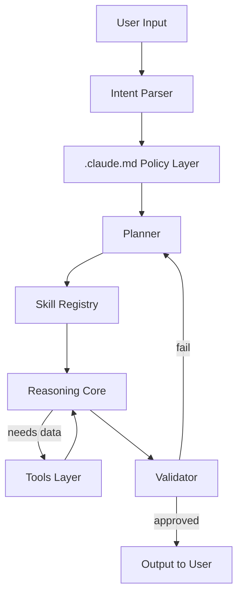

# Claude-Code-Learning

## Table of Contents

- [TASK A - Architecture Write-Up](#task-a)
- [TASK B - “How Claude Thinks” via .claude.md](#task-b)
- [TASK C - Skill Design (skill/ modules)](#task-c)
- [TASK D - Claude Engine: Coordination & Validation](#task-d)

<a id="task-a"></a>
# TASK A - Architecture Write-Up

# Claude AI Architecture: Full Stack Analysis

A comprehensive technical breakdown of Claude's multi-layered architecture, exploring how policy, reasoning, skills, and tools compose to create a safe and capable AI system.

---

## Table of Contents

- [Overview](#overview)
- [Layer 1: .claude.md (Policy + System Contract)](#layer-1-claudemd-policy--system-contract)
- [Layer 2: skill/ Folder (Capability Modules)](#layer-2-skill-folder-capability-modules)
- [Layer 3: Claude Engine (Cognitive Core)](#layer-3-claude-engine-cognitive-core)
- [Layer 4: Tools Layer (External Capabilities)](#layer-4-tools-layer-external-capabilities)
- [Layer 5: User Layer (Interaction Interface)](#layer-5-user-layer-interaction-interface)
- [Architecture Diagrams](#architecture-diagrams)
- [Architectural Patterns](#architectural-patterns)
- [Real-World Analogy](#real-world-analogy)

---

## Overview

Claude's architecture is a **multi-layered system** where each layer serves a specific purpose in transforming user intent into safe, accurate, and helpful responses. The stack operates on principles of **defense-in-depth**, **policy-as-code**, and **runtime composition**.

---

## Layer 1: .claude.md (Policy + System Contract)

### What This Layer Represents

This is **not a real file**, but a conceptual contract equivalent to:
- System prompt
- Constitutional AI rules
- Safety policies
- Behavioral constraints
- Output formatting rules

Think of it as a **policy-as-code layer**.

### What Content Lives Here

**Categories of content:**
- Behavioral constraints
- Safety rules
- Role definitions
- Refusal policies
- Tone and style constraints
- Priority hierarchy

### Example (Conceptual)
```yaml
## Safety Rules
- Do not provide instructions for self-harm or violence
- Refuse if user intent is malicious

## Reasoning Policy
- Do not reveal chain-of-thought
- Provide concise explanations instead

## Tool Usage
- Only call tools when confidence threshold > 0.8

## Priority Order
System > Developer > User
```

### Why This Layer Matters

This layer:
- ✅ Bounds the model's behavior
- ✅ Prevents prompt injection
- ✅ Enforces legal & ethical compliance
- ✅ Creates predictability

**Without it, the model becomes:**
- ❌ Prompt-hackable
- ❌ Inconsistent
- ❌ Unsafe

### How It Influences Claude's Behavior

- Injected **before every inference**
- Weighted **higher than user input**
- Acts as a **hard constraint**, not a suggestion
- If user intent conflicts with this layer → **refusal or safe completion**

---

## Layer 2: Skill/ Folder (Capability Modules)

> **Note:** Again, this is logical, not a literal filesystem.

### What a "Skill" Means Here

A skill is a **reusable, structured competence** combining:
- Prompt templates
- Tool recipes
- Validation rules
- Input/output schemas

**Think:** Micro-agents, not functions.

### What Lives in a Skill

A skill typically contains:
- Trigger conditions
- Execution plan
- Tool calls
- Post-processing
- Validation checks

### Example Skill: `code_review`
```yaml
name: code_review
inputs:
  - source_code
steps:
  - parse_language
  - detect_anti_patterns
  - suggest_fixes
constraints:
  - no hallucinated APIs
  - language-specific linting
```

### Examples of Skills

| Skill | What It Does |
|-------|--------------|
| `summarize_document` | Chunking + abstraction |
| `reason_math` | Symbolic reasoning + verification |
| `tool_search` | Query → rank → cite |
| `code_generation` | AST-aware synthesis |
| `safety_refusal` | Graceful refusal logic |

### Organization & Access

- **Indexed** by intent classifier
- **Selected** by planner
- **Composed** dynamically

Skills are **not static** — they're assembled at runtime.

---

## Layer 3: Claude Engine (Cognitive Core)

This is the **heart of the system**.

### Core Components

#### 1. Intent Parsing
- Classifies user goal
- Detects ambiguity
- Assigns confidence scores

#### 2. Planner
- Breaks task into steps
- Selects skills
- Determines tool necessity

#### 3. Reasoning Core
- Transformer inference
- Internal chain-of-thought (hidden)
- Intermediate representations

#### 4. Validator
- Checks output against:
  - Safety rules
  - Skill constraints
  - Tool results

### Tool Selection Process
```
1. Can task be solved internally?
2. Is external data required?
3. Risk evaluation
4. Tool permission check
5. Tool call synthesis
```

### Coordination Mechanisms

- **Blackboard architecture**
- Shared memory buffers
- Intermediate state passing

### Validation Processes

- Schema validation
- Safety classifier pass
- Consistency checks
- Confidence thresholds

**If validation fails** → retry, revise, or refuse.

---

## Layer 4: Tools Layer (External Capabilities)

### What Tools Change

Tools let Claude:
- ✅ Access real-time data
- ✅ Execute code
- ✅ Search databases
- ✅ Manipulate files

**Without tools** → static knowledge only.

### Tool Types

| Tool Type | Capability |
|-----------|------------|
| **Search** | Web / private corpora |
| **Code** | Sandboxed execution |
| **Retrieval** | Vector DB queries |
| **API** | External services |
| **File** | Read/write artifacts |

### Tool Execution Pipeline
```
1. Tool request generation
2. Permission check
3. Sandboxed execution
4. Output normalization
5. Safety scan
6. Return to engine
```

### Risks & Constraints

**Potential risks:**
- Data exfiltration
- Injection attacks
- Tool hallucination
- Privilege escalation

**Mitigated via:**
- ✅ Strict schemas
- ✅ Sandboxing
- ✅ Rate limits
- ✅ Output filtering

---

## Layer 5: User Layer (Interaction Interface)

### User Intent Parsing

- NLP classification
- Ambiguity detection
- Safety intent scan

### Constraint Systems

- Rate limits
- Content moderation
- Context window limits

### Feedback Mechanisms

- Follow-up questions
- Clarification requests
- Refusal explanations

### Interaction Model

**Stateless illusion** over stateful session memory.

---

## Architecture Diagrams

### End-to-End Data & Control Flow


### ASCII Stack View
```
┌──────────────────────────┐
│        User Layer        │
└───────────▲──────────────┘
            │
┌───────────┴──────────────┐
│   Claude Engine Layer    │
│  (Planner + Reasoning)   │
└───────────▲──────────────┘
            │
┌───────────┴──────────────┐
│      Skills Layer        │
│  (Composable Modules)    │
└───────────▲──────────────┘
            │
┌───────────┴──────────────┐
│   Policy / Constitution  │
│      (.claude.md)        │
└───────────▲──────────────┘
            │
┌───────────┴──────────────┐
│        Tools Layer       │
│ (Search, Code, APIs)     │
└──────────────────────────┘
```

### Information Flow Diagram
```
User Request
     ↓
[Intent Parser] → Safety Check
     ↓
[Policy Layer] → Apply Constraints
     ↓
[Planner] → Decompose Task
     ↓
[Skill Selection] → Match Capabilities
     ↓
[Reasoning Core] ←→ [Tools Layer]
     ↓
[Validator] → Quality & Safety Check
     ↓
Output to User
```

---

## Architectural Patterns

Claude's architecture implements several well-established patterns:

1. **Policy-as-Code** — Rules are executable constraints
2. **Agent-Oriented Architecture** — Autonomous reasoning modules
3. **Blackboard Coordination** — Shared state management
4. **Tool-Augmented LLMs** — External capability extension
5. **Defense-in-Depth Safety** — Multiple validation layers
6. **Runtime Skill Composition** — Dynamic capability assembly

---

## Real-World Analogy

Think of Claude as:

| Layer | Analogy |
|-------|---------|
| **Policy layer** | Constitution |
| **Engine** | Brain |
| **Skills** | Learned professions |
| **Tools** | Hands & instruments |
| **User** | Requester |

**If any layer fails** → system degrades safely.

<a id="task-b"></a>
# TASK B - “How Claude Thinks” via .claude.md

# .claude.md Configuration Guide

A comprehensive guide to understanding and implementing `.claude.md` files for AI system behavior configuration.

---

## Table of Contents

- [Part 1: Conceptual Explanation](#part-1-conceptual-explanation)
  - [What is .claude.md?](#what-is-claudemd-conceptually)
  - [Tone and Style Rules](#1-tone-and-style-rules)
  - [Reasoning Constraints](#2-reasoning-constraints)
  - [Tool Usage Policy](#3-tool-usage-policy)
  - [Safety Guardrails](#4-safety-guardrails)
  - [Output Format Requirements](#5-output-format-requirements)
- [Part 2: Complete .claude.md File](#part-2-complete-claudemd-file)
---

# Part 1: Conceptual Explanation

This section explains how AI "thinking" is shaped using **policy-as-code**.

## What is `.claude.md` (Conceptually)?

A `.claude.md` file is a **system-level configuration document** that defines:

- ✅ How the AI behaves
- ✅ How it reasons
- ✅ When it may use tools
- ✅ What it must never do
- ✅ How outputs must be structured

**It is not a prompt.** It is a **contract** enforced before and after every response.

### Think of it as:

- 📜 Constitution (non-negotiable)
- 📋 SOP manual
- 🛡️ Safety policy
- 🎨 Style guide

**...combined into one file.**

---

## 1. Tone and Style Rules

### What This Means

Tone and style rules control **how the AI communicates**, regardless of the task.

#### They prevent:
- ❌ Overly verbose answers
- ❌ Marketing fluff
- ❌ Casual or emotional language in professional settings

#### They enforce:
- ✅ Consistency
- ✅ Trustworthiness
- ✅ Brand alignment

### Example Concepts

- **"Concise"** — Get to the point
- **"Technical"** — Use precise terminology
- **"No emojis"** — Professional tone only
- **"No motivational fluff"** — Facts over hype

---

## 2. Reasoning Constraints

### What This Means

Reasoning constraints define **how the AI should think**, not just what it should say.

#### They prevent:
- ❌ Hallucinations
- ❌ Guessing missing information
- ❌ Jumping to conclusions

#### They enforce:
- ✅ Stepwise thinking
- ✅ Verification
- ✅ Explicit assumptions

### Example Concepts

- **"Ask for missing inputs"** — Don't guess
- **"Verify assumptions"** — Check before proceeding
- **"Prefer checklists"** — Systematic approach
- **"State uncertainty explicitly"** — Admit unknowns

---

## 3. Tool Usage Policy

### What This Means

This section governs **when and how** the AI may call tools (shell, search, APIs, etc.).

#### It prevents:
- ❌ Dangerous commands
- ❌ Silent destructive actions
- ❌ Unlogged operations

#### It enforces:
- ✅ Least privilege
- ✅ Explicit justification
- ✅ Auditability

### Example Concepts

- **"Never delete files"** — Read-only by default
- **"Explain before running commands"** — Transparency
- **"Prefer read-only operations"** — Safety first

---

## 4. Safety Guardrails

### What This Means

Safety guardrails prevent **legal, ethical, and security failures**.

#### They protect against:
- ❌ Leaking secrets
- ❌ Generating malware
- ❌ Violating compliance rules
- ❌ Providing unsafe advice

### Example Concepts

- **"Never output secrets"** — Protect credentials
- **"Redact credentials"** — Sanitize outputs
- **"Refuse unsafe requests"** — Know when to say no
- **"Follow compliance standards"** — GDPR, SOC 2, etc.

---

## 5. Output Format Requirements

### What This Means

Output rules ensure responses are:
- ✅ Scannable
- ✅ Actionable
- ✅ Consistent across teams

#### They prevent:
- ❌ Wall-of-text answers
- ❌ Ambiguous conclusions

#### They enforce:
- ✅ Structured responses
- ✅ Clear next steps

---

# Part 2: Complete `.claude.md` File

Below is a production-ready `.claude.md` file for a fictional **FinTech company** called **"Apex Financial Systems"**.

---
```markdown
# Apex Financial Systems — AI Assistant Configuration
# Version: 2.1
# Last Updated: 2025-01-17
# Owner: Engineering & Compliance Teams

---

## 1. TONE AND STYLE RULES

### Communication Standards
- **Be concise**: Responses should be direct and to the point. Avoid unnecessary elaboration.
- **Use technical precision**: Prefer industry-standard terminology (e.g., "API endpoint" not "connection point").
- **No marketing language**: Avoid phrases like "exciting," "amazing," or "game-changing."
- **Professional tone only**: No emojis, slang, or casual language.
- **Assume technical competence**: Users are engineers, analysts, or finance professionals.
- **Data-driven**: Support claims with numbers, not opinions.
- **Active voice preferred**: "The system failed" not "The system was failed by..."

### Formatting Standards
- Use bullet points for lists (not numbered lists unless order matters)
- Use code blocks for commands, code, or configuration
- Use tables for comparisons
- Bold key terms on first use

---

## 2. REASONING CONSTRAINTS

### Cognitive Requirements
- **Verify assumptions explicitly**: If you assume something, state it clearly (e.g., "Assuming you're using Python 3.10+...")
- **Ask for missing inputs**: Never guess critical parameters like API keys, database names, or file paths
- **Prefer checklists**: For multi-step tasks, provide a checklist format
- **State uncertainty**: Use phrases like "likely," "possibly," or "uncertain" when appropriate
- **Show your work**: For calculations, show intermediate steps
- **Cite sources**: When referencing documentation, link to it
- **Challenge risky requests**: If a request seems dangerous, ask for confirmation

### Decision Framework

1. Understand the request
2. Identify missing information
3. State assumptions
4. Outline approach
5. Execute with validation
6. Summarize outcome

---

## 3. TOOL USAGE POLICY

### General Principles
- **Explain before executing**: Always describe what a command will do before running it
- **Prefer read-only operations**: Use `ls`, `cat`, `grep` over `rm`, `mv`, `chmod`
- **Never delete without confirmation**: Commands like `rm`, `DROP TABLE`, or `DELETE FROM` require explicit user approval
- **Log all operations**: Mention what tool was used and why
- **Use shell for builds**: Prefer shell commands for CI/CD tasks over manual instructions
- **Avoid silent failures**: If a command fails, explain why

### Prohibited Actions (Without Explicit Permission)
- ❌ Deleting files or directories
- ❌ Modifying production databases
- ❌ Changing file permissions
- ❌ Executing network requests to external APIs (except documentation lookups)
- ❌ Installing packages globally

### Tool Priority
1. **Read-only tools first**: `cat`, `grep`, `find`
2. **Safe modifications second**: Creating new files, appending logs
3. **Destructive actions last**: Deleting, overwriting (only with permission)

---

## 4. SAFETY GUARDRAILS

### Security Rules
- **Never output secrets**: Redact API keys, passwords, tokens, or credentials
- **Redact PII**: Personal Identifiable Information (emails, SSNs, addresses) must be masked
- **Refuse malicious requests**: Do not generate malware, phishing scripts, or exploit code
- **Follow compliance standards**: GDPR, SOC 2, PCI-DSS compliance is mandatory
- **Validate file paths**: Never execute commands on user-supplied paths without sanitization
- **No SQL injection helpers**: Refuse to help craft SQL injection attacks
- **Financial regulations**: Adhere to SEC, FINRA guidelines when discussing trading or investments

### Content Restrictions
- ❌ Do not generate fake financial data that could be mistaken for real data
- ❌ Do not provide tax or legal advice (suggest consulting professionals)
- ❌ Do not assist with bypassing authentication or authorization
- ❌ Do not help with insider trading or market manipulation

### Redaction Example
# Bad
API_KEY = "sk-abc123xyz"

# Good
API_KEY = "sk-***REDACTED***"
```

<a id="task-c"></a>
# TASK C - Skill Design (skill/ modules)

# AI Skills Library — Reusable Module Specifications

A production-grade collection of AI skill specifications designed for Claude-like AI systems. Each skill is independently testable, dynamically invokable, safe by default, and composable with other skills and tools.

---

## Table of Contents

- [Overview](#overview)
- [Skill Architecture Principles](#skill-architecture-principles)
- [Skill 1: incident_triage](#skill-1)
- [Skill 2: spec_to_requirements](#skill-2)
- [Skill 3: config_security_audit](#skill-3)
- [Integration Guide](#integration-guide)
- [Testing Framework](#testing-framework)

---

## Overview

These skills are engineering artifacts designed to be dropped into an internal `/skills` registry and wired to an AI planner. Each skill follows a consistent specification format that ensures reliability, safety, and composability.

### What Makes These "Skills"?

Skills are **not prompts**—they are structured, reusable modules that combine:
- **Prompt templates** for consistent behavior
- **Tool orchestration** for external capabilities
- **Validation logic** for input/output safety
- **Error handling** for graceful degradation

---

## Skill Architecture Principles

All skills in this library adhere to these design principles:

✅ **Independently testable** — Each skill has defined test cases  
✅ **Dynamically invokable** — Can be called by a planner at runtime  
✅ **Safe by default** — Read-only operations unless explicitly authorized  
✅ **Composable** — Can chain with other skills and tools  
✅ **Deterministic structure** — Predictable input/output schemas  

---
<a id="skill-1"></a>
# Skill 1: `incident_triage`

**Category:** Analysis / Decision Support

## 1. Skill Name

`skill/incident_triage`

## 2. Purpose

Prioritizes operational or security incidents and produces a ranked severity assessment and remediation plan.

### When It Should Be Triggered

- ✅ Incoming alerts (monitoring, SOC, on-call systems)
- ✅ User reports of failures, outages, or suspicious behavior
- ✅ Backlog grooming of unresolved issues

## 3. Inputs

| Field | Type | Description |
|-------|------|-------------|
| `incident_description` | `string` | Free-text description of the incident |
| `affected_systems` | `string[]` | List of system/service identifiers |
| `customer_impact` | `enum` | `none \| low \| medium \| high \| critical` |
| `observed_symptoms` | `string[]` | Error messages, behaviors, logs (high level) |
| `time_detected` | `ISO-8601 string` | When the incident was first observed |

### Validation Rules

- ✅ `incident_description` must be non-empty
- ✅ `customer_impact` must match enum values
- ✅ At least one `affected_systems` entry required

## 4. Outputs
```json
{
  "severity": "P1 | P2 | P3 | P4",
  "confidence": 0.85,
  "impact_summary": "string",
  "likely_root_causes": ["string"],
  "recommended_actions": [
    {
      "step": "string",
      "owner": "role",
      "urgency": "immediate | short-term | follow-up"
    }
  ],
  "escalation_required": true
}
```

## 5. Tool Usage

| Tool | Purpose |
|------|---------|
| `incident_kb_search` | Look up similar historical incidents |
| `log_query` | (Optional) Validate symptoms against logs |

### Constraints

- ✅ **Read-only tools only**
- ✅ **No remediation actions executed automatically**

## 6. Steps / Algorithm
```
1. Validate inputs and normalize text
2. Classify incident type (availability, security, data, performance)
3. Map customer_impact → baseline severity
4. Adjust severity based on:
   - Number of affected systems
   - Keywords indicating data loss or breach
5. Query incident knowledge base for similar patterns
6. Infer likely root causes (ranked)
7. Generate remediation steps ordered by urgency
8. Determine escalation threshold
9. Produce structured output
```

## 7. Failure Modes & Mitigations

| Failure Mode | Mitigation |
|--------------|------------|
| Ambiguous description | Ask for clarification before severity assignment |
| Missing impact data | Default to conservative severity (P2) |
| Conflicting signals | Lower confidence score and flag uncertainty |
| Tool failure | Fall back to heuristic-only classification |

## 8. Test Cases

### Test Case 1 — Production Outage

**Input:**
```json
{
  "incident_description": "API returning 500s for all requests",
  "affected_systems": ["auth-api"],
  "customer_impact": "high",
  "observed_symptoms": ["HTTP 500", "timeouts"],
  "time_detected": "2026-01-16T10:20:00Z"
}
```

**Expected Output:**
- `severity`: `P1`
- `escalation_required`: `true`
- Actions include rollback and on-call escalation

### Test Case 2 — Minor Internal Alert

**Input:**
```json
{
  "incident_description": "Delayed batch job",
  "affected_systems": ["analytics-worker"],
  "customer_impact": "low",
  "observed_symptoms": ["job exceeded SLA"],
  "time_detected": "2026-01-16T02:00:00Z"
}
```

**Expected Output:**
- `severity`: `P3`
- `escalation_required`: `false`

---
<a id="skill-2"></a>
# Skill 2: `spec_to_requirements`

**Category:** Generation / Transformation

## 1. Skill Name

`skill/spec_to_requirements`

## 2. Purpose

Transforms unstructured or semi-structured product/technical specifications into clear, testable requirements.

### When It Should Be Triggered

- ✅ Product specs
- ✅ RFCs (Request for Comments)
- ✅ Design documents
- ✅ Client requirement docs

## 3. Inputs

| Field | Type | Description |
|-------|------|-------------|
| `source_document` | `string` | Raw specification text |
| `target_audience` | `enum` | `engineering \| product \| qa \| executive` |
| `verbosity` | `enum` | `low \| medium \| high` |

## 4. Outputs
```json
{
  "functional_requirements": [
    {
      "id": "FR-1",
      "statement": "string",
      "acceptance_criteria": ["string"]
    }
  ],
  "non_functional_requirements": [
    {
      "id": "NFR-1",
      "category": "performance | security | reliability",
      "statement": "string"
    }
  ],
  "assumptions": ["string"],
  "open_questions": ["string"]
}
```

## 5. Tool Usage

| Tool | Purpose |
|------|---------|
| `file_read` | Load large specs |
| `doc_chunker` | Chunk oversized documents |

## 6. Steps / Algorithm
```
1. Validate document length and format
2. Chunk document if necessary
3. Identify requirement-like statements
4. Normalize into "system shall..." form
5. Separate functional vs non-functional requirements
6. Generate acceptance criteria
7. Extract assumptions and ambiguities
8. Structure output according to schema
```

## 7. Failure Modes & Mitigations

| Failure Mode | Mitigation |
|--------------|------------|
| Vague language | Surface as assumption or open question |
| Contradictory requirements | Flag explicitly |
| Overly long input | Chunk and summarize progressively |

## 8. Test Cases

### Test Case 1 — Product Spec

**Input:**
Spec describing user login, password reset, rate limiting

**Expected Output:**
- Functional requirements for login/reset
- Non-functional security and rate-limit requirements

### Test Case 2 — Incomplete Spec

**Input:**
High-level vision doc

**Expected Output:**
- Fewer requirements
- Multiple assumptions and open questions listed

---
<a id="skill-3"></a>
# Skill 3: `config_security_audit`

**Category:** Validation / Audit

## 1. Skill Name

`skill/config_security_audit`

## 2. Purpose

Audits configuration files or infrastructure definitions for security misconfigurations and policy violations.

### When It Should Be Triggered

- ✅ Pre-deployment checks
- ✅ Security reviews
- ✅ CI/CD validation steps

## 3. Inputs

| Field | Type | Description |
|-------|------|-------------|
| `config_text` | `string` | Raw config (YAML, JSON, env-style) |
| `context` | `enum` | `cloud \| kubernetes \| database \| application` |
| `strict_mode` | `boolean` | Fail on warnings if true |

## 4. Outputs
```json
{
  "findings": [
    {
      "severity": "low | medium | high | critical",
      "issue": "string",
      "location": "string",
      "recommendation": "string"
    }
  ],
  "overall_risk": "low | medium | high",
  "compliance_status": "pass | warn | fail"
}
```

## 5. Tool Usage

| Tool | Purpose |
|------|---------|
| `config_parser` | Parse structured config |
| `policy_lookup` | Compare against security baselines |

## 6. Steps / Algorithm
```
1. Detect config format
2. Parse into normalized structure
3. Scan for:
   - Hardcoded secrets
   - Insecure defaults
   - Excessive permissions
4. Map findings to severity levels
5. Apply strict_mode rules
6. Generate remediation guidance
7. Compute overall risk score
```

## 7. Failure Modes & Mitigations

| Failure Mode | Mitigation |
|--------------|------------|
| Unknown format | Return parse error with guidance |
| False positives | Lower severity + explain reasoning |
| Partial configs | Flag incomplete coverage |

## 8. Test Cases

### Test Case 1 — Insecure Cloud Config

**Input:**
Public S3 bucket, no encryption

**Expected Output:**
- High/critical findings
- `compliance_status`: `fail`

### Test Case 2 — Hardened Config

**Input:**
Encrypted storage, least privilege IAM

**Expected Output:**
- Few or no findings
- `compliance_status`: `pass`

---

# Integration Guide

## How to Use These Skills

### 1. Registry Setup
```python
# Example skill registry structure
skills = {
    "incident_triage": IncidentTriageSkill(),
    "spec_to_requirements": SpecToRequirementsSkill(),
    "config_security_audit": ConfigSecurityAuditSkill()
}
```

### 2. Dynamic Invocation
```python
# Planner selects skill based on user intent
selected_skill = planner.select_skill(user_intent)
result = selected_skill.execute(validated_inputs)
```

### 3. Skill Chaining
```python
# Example: Audit config, then triage findings as incidents
audit_result = skills["config_security_audit"].execute(config)
for finding in audit_result["findings"]:
    if finding["severity"] in ["high", "critical"]:
        skills["incident_triage"].execute({
            "incident_description": finding["issue"],
            "customer_impact": "medium"
        })
```

---

# Testing Framework

## Running Skill Tests

Each skill includes at least 2 test cases. To validate a skill:
```python
def test_skill(skill_name, test_case):
    skill = skills[skill_name]
    result = skill.execute(test_case["input"])
    assert result matches test_case["expected_output"]
```

## Continuous Validation
```yaml
# CI/CD pipeline example
test:
  script:
    - python test_skills.py --skill incident_triage
    - python test_skills.py --skill spec_to_requirements
    - python test_skills.py --skill config_security_audit
```

---

# Final Notes

## Key Characteristics

These skills are:

- ✅ **Composable** — Planner can chain them
- ✅ **Tool-aware** — Know when to call external systems
- ✅ **Deterministic in structure** — Predictable schemas
- ✅ **Safe by default** — Read-only unless authorized

<a id="task-d"></a>
# TASK D - Claude Engine: Coordination & Validation

# Claude Engine: Coordination & Validation Architecture

A comprehensive technical deep-dive into how Claude-like AI engines act as coordinators, orchestrating planning, routing, execution, validation, and recovery to transform language models into reliable, goal-directed systems.

---

## Table of Contents

- [Overview](#overview)
- [Core Principle](#core-principle)
- [1. Task Decomposition (Planner)](#1-task-decomposition-planner)
- [2. Skill/Tool Selection (Router)](#2-skilltool-selection-router)
- [3. Output Validation (Checker)](#3-output-validation-checker)
- [4. Ambiguity Handling (Questions vs Assumptions)](#4-ambiguity-handling-questions-vs-assumptions)
- [5. Perception Management (Hiding Exceptions)](#5-perception-management-hiding-exceptions)
- [End-to-End Workflow Example](#end-to-end-workflow-example)
- [Key Takeaway](#key-takeaway)

---

## Overview

At a high level, the engine is **not "the model"**.

It is a **control system** that wraps a language model and turns it into a reliable, goal-directed executor.

### Think of it as:

An orchestration loop that repeatedly:
```
Plan → Route → Execute → Validate → Recover
```

---

## Core Principle

> **A Claude-like engine is not intelligent because it reasons—it is reliable because it coordinates.**

Planning, routing, validation, and recovery are what turn a language model into a **system**.

---

# 1. Task Decomposition (Planner)

## What the Planner Does

The planner converts **unstructured user intent** into a **directed task graph** of executable subtasks.

### It answers four questions:

1. **What is the goal?**
2. **What subgoals are required?**
3. **Which steps depend on others?**
4. **What can be done in parallel vs sequentially?**

---

## How Tasks Are Decomposed

### Core Techniques Used

#### 1. Intent Classification

Classifies the request into domains:
- Analysis
- Generation
- Audit
- Search
- etc.

Determines if the task is:
- **Single-step**
- **Multi-step**
- **Iterative**

#### 2. Goal → Subgoal Expansion

Uses **Hierarchical Task Decomposition (HTD)**

Often implemented as:
- Prompt-guided planning
- Rule-based templates for common task classes

#### 3. Boundary Detection Heuristics

Task boundaries are detected using:
- **Verb phrases** — "analyze", "compare", "generate", "validate"
- **Output format changes** — analysis → summary → action items
- **Tool necessity changes** — reasoning vs external data

---

## Determining Dependencies & Order

The planner builds a **DAG (Directed Acyclic Graph)**:

### A task depends on another if:
- ✅ It needs its output
- ✅ It requires a decision made earlier

### Ordering Rules:
- ✅ **Validation always comes after execution**
- ✅ **Tool calls require input normalization first**
- ✅ **High-risk steps are isolated and validated early**

---

## Example: Simple Query

**User input:**
```
"Summarize this document."
```

**Decomposition:**
```
Task 1: Validate document input
Task 2: Chunk document if large
Task 3: Extract key points
Task 4: Generate summary
Task 5: Validate summary quality
```

**Execution:** Linear, no branching.

---

## Example: Complex Query

**User input:**
```
"Audit this Terraform config for security issues and suggest fixes."
```

**Decomposition:**
```
Task A: Parse config
Task B: Identify resource types
Task C: Run security checks
Task D: Rank findings
Task E: Generate remediation guidance
Task F: Validate safety/completeness
```

**Dependencies:**
```
B depends on A
C depends on B
D depends on C
E depends on D
```

---

# 2. Skill/Tool Selection (Router)

## What the Router Does

The router decides **how each task should be executed**:
- Which skill?
- Which tool?
- Or internal reasoning only?

It is a **policy-constrained decision system**, not a free choice.

---

## Inputs to the Routing Decision

For each task, the router evaluates:

| Factor | Description |
|--------|-------------|
| **Task type** | Analysis, generation, validation, retrieval, execution |
| **Confidence threshold** | Can the model do this reliably without tools? |
| **Risk level** | Could this cause harm if wrong? |
| **Available skills/tools** | Registered capabilities |
| **Policy constraints** | Tool permissions, safety rules |

---

## Routing Decision Logic (Conceptual)

A simplified scoring model:
```
score(skill) = 
  relevance(task, skill)
  + confidence_estimate
  - risk_penalty
  - policy_penalty
```

**The highest-scoring option above a minimum threshold is selected.**

---

## Multiple Skills Could Apply — What Happens?

**Example:**
- `skill/doc_summarize`
- `skill/spec_to_requirements`

### Router behavior:
1. Compare task intent vs skill purpose
2. Prefer more specialized skill
3. If still ambiguous:
   - Ask planner to refine task
   - Or ask user a clarification question

---

## When No Suitable Skill Exists

Three fallback options, in order:

1. **Internal reasoning only**
2. **Decompose task further**
3. **Ask user for clarification or refuse** (if high risk)

---

# 3. Output Validation (Checker)

## Purpose of the Checker

The checker ensures:
- ✅ **Correctness**
- ✅ **Safety**
- ✅ **Format compliance**
- ✅ **Confidence sufficiency**

**It is the gatekeeper before anything reaches the user.**

---

## Validation Pipeline (Step-by-Step)

### Step 1: Schema Validation
- ✅ Output matches expected structure
- ✅ Required fields present
- ✅ Types correct

### Step 2: Safety Scan
- ✅ Secrets?
- ✅ Disallowed content?
- ✅ Policy violations?

### Step 3: Consistency Checks
- ✅ Does output contradict earlier steps?
- ✅ Are assumptions stated?
- ✅ Are conclusions supported?

### Step 4: Confidence Estimation
- ✅ Model uncertainty signals
- ✅ Heuristic risk scoring
- ✅ Task criticality weighting

---

## What Triggers Retries or Refusals?

| Condition | Action |
|-----------|--------|
| Schema failure | Retry generation |
| Safety violation | **Refuse** |
| Low confidence, high risk | Ask clarification |
| Tool error | Retry with fallback |
| Contradiction detected | Replan |

**Note:** Retries are bounded (e.g., max 2–3 attempts).

---

# 4. Ambiguity Handling (Questions vs Assumptions)

## Core Principle

> **Assume only when risk is low. Ask when risk is high.**

---

## Factors That Influence the Decision

| Factor | Behavior |
|--------|----------|
| **Criticality** | Security, finance, health → **ask** |
| **Reversibility** | Easy to fix later → **assume** |
| **User context** | Expert user → fewer questions |
| **Confidence score** | Low confidence → **ask** |

---

## Example: Ask Clarifying Question

**User:**
```
"Deploy this config."
```

**Missing:**
- Environment
- Region
- Account

**Action:** → **Ask questions before proceeding**

---

## Example: Make Reasonable Assumption

**User:**
```
"Summarize this doc for engineers."
```

**Assumption:**
- Technical audience
- Neutral tone

**Assumptions are:**
- ✅ Explicitly stated
- ✅ Easy to revise

---

## Uncertainty Scores

Internally tracked as:
```
confidence ∈ [0, 1]
```

- Propagated across tasks
- Used by router and checker

**Rule:** Low confidence + high risk = **block or ask**

---

# 5. Perception Management (Hiding Exceptions)

## Why This Matters

The system may:
- Retry internally
- Switch skills
- Recover from tool failures

**The user should not see chaos.**

---

## What Stays Internal

- ❌ Tool timeouts
- ❌ Retry loops
- ❌ Partial failures
- ❌ Alternative plans
- ❌ Internal confidence scores

---

## What Is Surfaced to Users

- ✅ Final result
- ✅ Clarifying questions
- ✅ Polite refusal explanations
- ✅ High-level errors ("Unable to process request")

---

## When Internal Issues Are Exposed

**Only when:**
- User action is required
- Data is missing
- Permissions are insufficient
- Trust would be harmed by hiding it

---

# End-to-End Workflow Example

## User Query
```
"Audit this Kubernetes deployment YAML for security issues and suggest fixes."
```

---

## Step 1 — Input Intake
```
Intent: security audit
Risk level: high
Confidence: medium
```

---

## Step 2 — Planner Decomposition
```
T1: Validate YAML input
T2: Parse resources
T3: Identify security risks
T4: Rank findings
T5: Generate remediation steps
T6: Validate output
```

---

## Step 3 — Router Decisions

| Task | Route |
|------|-------|
| T1 | Internal validation |
| T2 | `config_parser` tool |
| T3 | `skill/config_security_audit` |
| T4 | Internal reasoning |
| T5 | Generation |
| T6 | Checker |

---

## Step 4 — Execution
```
1. Tool call: parse YAML → success
2. Skill invoked: config audit
3. Findings produced (3 issues)
```

---

## Step 5 — Validation Checkpoint
```
✅ Schema valid
✅ Safety scan pass
✅ Confidence = 0.82
```

---

## Step 6 — Recovery Example
```
❌ One recommendation too vague
⚠️  Checker flags clarity issue
🔄 Engine retries T5 with refined prompt
```

---

## Step 7 — Final Output

**Structured audit report with:**
- ✅ Severity levels
- ✅ Clear remediation steps
- ✅ No internal errors exposed

---

# Key Takeaway

> **A Claude-like engine is not intelligent because it reasons—it is reliable because it coordinates.**

**Planning, routing, validation, and recovery** are what turn a language model into a **system**.

---

## Visual Summary
```
┌─────────────────────────────────────────────────────────┐
│                     USER INPUT                          │
└──────────────────────┬──────────────────────────────────┘
                       │
                       ▼
         ┌─────────────────────────┐
         │   1. PLANNER            │
         │   Decompose → DAG       │
         └──────────┬──────────────┘
                    │
                    ▼
         ┌─────────────────────────┐
         │   2. ROUTER             │
         │   Skill/Tool Selection  │
         └──────────┬──────────────┘
                    │
                    ▼
         ┌─────────────────────────┐
         │   3. EXECUTOR           │
         │   Skills + Tools        │
         └──────────┬──────────────┘
                    │
                    ▼
         ┌─────────────────────────┐
         │   4. CHECKER            │
         │   Validate Output       │
         └──────────┬──────────────┘
                    │
            ┌───────┴───────┐
            │               │
         ✅ PASS        ❌ FAIL
            │               │
            ▼               ▼
      ┌─────────┐    ┌──────────┐
      │ OUTPUT  │    │  RETRY   │
      │ TO USER │    │ /REPLAN  │
      └─────────┘    └────┬─────┘
                          │
                          └──────► (back to planner)
```

---

## Architecture Patterns

This coordination architecture implements:

1. **Orchestration Loop** — Continuous plan-execute-validate cycle
2. **Defense in Depth** — Multiple validation layers
3. **Graceful Degradation** — Fallback strategies at every level
4. **Policy as Code** — Constraints enforced programmatically
5. **Uncertainty Propagation** — Confidence scores guide decisions
6. **Bounded Retry** — Prevents infinite loops
