```mermaid
flowchart TB
    subgraph USER["🧑 USER LAYER"]
        UI[User Input]
        UP[Intent Parser]
        UF[Feedback Handler]
        UC[Constraint Manager]
    end

    subgraph ENGINE["🧠 CLAUDE ENGINE LAYER"]
        PL[Planner]
        RT[Router]
        RC[Reasoning Core]
        VL[Validator]
    end

    subgraph SKILLS["⚙️ SKILLS LAYER"]
        S1[Skill: Code Review]
        S2[Skill: Document Summary]
        S3[Skill: Security Audit]
        S4[Skill: Data Analysis]
    end

    subgraph POLICY["📜 POLICY/CONSTITUTION LAYER"]
        POL[".claude.md"]
        SAF[Safety Rules]
        BEH[Behavioral Constraints]
        PRI[Priority Hierarchy]
    end

    subgraph TOOLS["🔧 TOOLS LAYER"]
        T1[Web Search]
        T2[Code Execution]
        T3[File Operations]
        T4[API Calls]
    end

    %% User to Engine
    UI -->|user query| UP
    UP -->|parsed intent| PL
    UF -.->|clarifications| PL

    %% Engine Internal Flow
    PL -->|task plan| POL
    POL -->|policy check| RT
    RT -->|select skill| SKILLS
    RT -->|or direct reasoning| RC
    SKILLS -->|execute| RC
    RC -->|needs tools?| TOOLS
    TOOLS -->|tool results| RC
    RC -->|output| VL
    
    %% Validation & Feedback
    VL -->|policy check| POL
    VL -->|✅ approved| UF
    VL -->|❌ rejected| PL
    
    %% Policy Enforcement Points
    POL -.->|enforce| RT
    POL -.->|enforce| RC
    POL -.->|enforce| TOOLS

    %% Output to User
    UF -->|final response| UI

    %% Styling
    classDef userStyle fill:#e1f5ff,stroke:#0288d1,stroke-width:2px
    classDef engineStyle fill:#fff3e0,stroke:#f57c00,stroke-width:2px
    classDef skillStyle fill:#f3e5f5,stroke:#7b1fa2,stroke-width:2px
    classDef policyStyle fill:#ffebee,stroke:#c62828,stroke-width:2px
    classDef toolStyle fill:#e8f5e9,stroke:#388e3c,stroke-width:2px

    class UI,UP,UF,UC userStyle
    class PL,RT,RC,VL engineStyle
    class S1,S2,S3,S4 skillStyle
    class POL,SAF,BEH,PRI policyStyle
    class T1,T2,T3,T4 toolStyle
```

```mermaid
flowchart TB
    USER[👤 User Request]
    COORD[🎯 Coordinator Agent]
    
    subgraph SEQUENTIAL["⚡ SEQUENTIAL PHASE"]
        GEN[🔧 Code Generator Agent]
    end
    
    subgraph PARALLEL["🔀 PARALLEL PHASE"]
        REV[📝 Code Reviewer Agent]
        SEC[🔒 Security Auditor Agent]
        TEST[✅ Test Designer Agent]
    end
    
    CONFLICT{⚠️ Conflicts?}
    RESOLUTION[🔄 Conflict Resolution]
    MERGE[📦 Merge & Aggregate]
    OUTPUT[📤 Final Output]

    USER -->|initial request| COORD
    COORD -->|decompose task| COORD
    COORD -->|Task 1: Generate| GEN
    GEN -->|code artifact| COORD
    
    COORD -->|Task 2: Review| REV
    COORD -->|Task 3: Audit| SEC
    COORD -->|Task 4: Test| TEST
    
    REV -->|review results| CONFLICT
    SEC -->|security findings| CONFLICT
    TEST -->|test cases| CONFLICT
    
    CONFLICT -->|YES| RESOLUTION
    CONFLICT -->|NO| MERGE
    
    RESOLUTION -->|Security Veto?| COORD
    RESOLUTION -->|Revise Code| GEN
    RESOLUTION -->|Resolved| MERGE
    
    MERGE -->|validate & combine| OUTPUT
    OUTPUT -->|deliver| USER

    %% Styling
    classDef coordStyle fill:#fff3e0,stroke:#f57c00,stroke-width:3px
    classDef seqStyle fill:#e3f2fd,stroke:#1976d2,stroke-width:2px
    classDef parallelStyle fill:#f3e5f5,stroke:#7b1fa2,stroke-width:2px
    classDef decisionStyle fill:#ffebee,stroke:#c62828,stroke-width:2px
    classDef mergeStyle fill:#e8f5e9,stroke:#388e3c,stroke-width:2px

    class COORD coordStyle
    class GEN seqStyle
    class REV,SEC,TEST parallelStyle
    class CONFLICT,RESOLUTION decisionStyle
    class MERGE,OUTPUT mergeStyle
```

# Claude-Code-Learning

## Table of Contents

- [TASK A - Architecture Write-Up](#task-a)
- [TASK B - “How Claude Thinks” via .claude.md](#task-b)
- [TASK C - Skill Design (skill/ modules)](#task-c)
- [TASK D - Claude Engine: Coordination & Validation](#task-d)
- [TASK E - Agent Basics (Conceptual)](#task-e)
- [TASK F - Build 2 Agents (Practical Design)](#task-f)
- [TASK G - Multi-Agent Orchestration (Advanced)](#task-g)
- [Claude Architecture Diagrams](#diagram)

<a id="task-a"></a>
# TASK A - Architecture Write-Up

# Claude AI Architecture: Full Stack Analysis

A comprehensive technical breakdown of Claude's multi-layered architecture, exploring how policy, reasoning, skills, and tools compose to create a safe and capable AI system.

---

## Table of Contents

- [Overview](#overview)
- [Layer 1: .claude.md (Policy + System Contract)](#layer-1-claudemd-policy--system-contract)
- [Layer 2: skill/ Folder (Capability Modules)](#layer-2-skill-folder-capability-modules)
- [Layer 3: Claude Engine (Cognitive Core)](#layer-3-claude-engine-cognitive-core)
- [Layer 4: Tools Layer (External Capabilities)](#layer-4-tools-layer-external-capabilities)
- [Layer 5: User Layer (Interaction Interface)](#layer-5-user-layer-interaction-interface)
- [Architecture Diagrams](#architecture-diagrams)
- [Architectural Patterns](#architectural-patterns)
- [Real-World Analogy](#real-world-analogy)

---

## Overview

Claude's architecture is a **multi-layered system** where each layer serves a specific purpose in transforming user intent into safe, accurate, and helpful responses. The stack operates on principles of **defense-in-depth**, **policy-as-code**, and **runtime composition**.

---

## Layer 1: .claude.md (Policy + System Contract)

### What This Layer Represents

This is **not a real file**, but a conceptual contract equivalent to:
- System prompt
- Constitutional AI rules
- Safety policies
- Behavioral constraints
- Output formatting rules

Think of it as a **policy-as-code layer**.

### What Content Lives Here

**Categories of content:**
- Behavioral constraints
- Safety rules
- Role definitions
- Refusal policies
- Tone and style constraints
- Priority hierarchy

### Example (Conceptual)
```yaml
## Safety Rules
- Do not provide instructions for self-harm or violence
- Refuse if user intent is malicious

## Reasoning Policy
- Do not reveal chain-of-thought
- Provide concise explanations instead

## Tool Usage
- Only call tools when confidence threshold > 0.8

## Priority Order
System > Developer > User
```

### Why This Layer Matters

This layer:
- ✅ Bounds the model's behavior
- ✅ Prevents prompt injection
- ✅ Enforces legal & ethical compliance
- ✅ Creates predictability

**Without it, the model becomes:**
- ❌ Prompt-hackable
- ❌ Inconsistent
- ❌ Unsafe

### How It Influences Claude's Behavior

- Injected **before every inference**
- Weighted **higher than user input**
- Acts as a **hard constraint**, not a suggestion
- If user intent conflicts with this layer → **refusal or safe completion**

---

## Layer 2: Skill/ Folder (Capability Modules)

> **Note:** Again, this is logical, not a literal filesystem.

### What a "Skill" Means Here

A skill is a **reusable, structured competence** combining:
- Prompt templates
- Tool recipes
- Validation rules
- Input/output schemas

**Think:** Micro-agents, not functions.

### What Lives in a Skill

A skill typically contains:
- Trigger conditions
- Execution plan
- Tool calls
- Post-processing
- Validation checks

### Example Skill: `code_review`
```yaml
name: code_review
inputs:
  - source_code
steps:
  - parse_language
  - detect_anti_patterns
  - suggest_fixes
constraints:
  - no hallucinated APIs
  - language-specific linting
```

### Examples of Skills

| Skill | What It Does |
|-------|--------------|
| `summarize_document` | Chunking + abstraction |
| `reason_math` | Symbolic reasoning + verification |
| `tool_search` | Query → rank → cite |
| `code_generation` | AST-aware synthesis |
| `safety_refusal` | Graceful refusal logic |

### Organization & Access

- **Indexed** by intent classifier
- **Selected** by planner
- **Composed** dynamically

Skills are **not static** — they're assembled at runtime.

---

## Layer 3: Claude Engine (Cognitive Core)

This is the **heart of the system**.

### Core Components

#### 1. Intent Parsing
- Classifies user goal
- Detects ambiguity
- Assigns confidence scores

#### 2. Planner
- Breaks task into steps
- Selects skills
- Determines tool necessity

#### 3. Reasoning Core
- Transformer inference
- Internal chain-of-thought (hidden)
- Intermediate representations

#### 4. Validator
- Checks output against:
  - Safety rules
  - Skill constraints
  - Tool results

### Tool Selection Process
```
1. Can task be solved internally?
2. Is external data required?
3. Risk evaluation
4. Tool permission check
5. Tool call synthesis
```

### Coordination Mechanisms

- **Blackboard architecture**
- Shared memory buffers
- Intermediate state passing

### Validation Processes

- Schema validation
- Safety classifier pass
- Consistency checks
- Confidence thresholds

**If validation fails** → retry, revise, or refuse.

---

## Layer 4: Tools Layer (External Capabilities)

### What Tools Change

Tools let Claude:
- ✅ Access real-time data
- ✅ Execute code
- ✅ Search databases
- ✅ Manipulate files

**Without tools** → static knowledge only.

### Tool Types

| Tool Type | Capability |
|-----------|------------|
| **Search** | Web / private corpora |
| **Code** | Sandboxed execution |
| **Retrieval** | Vector DB queries |
| **API** | External services |
| **File** | Read/write artifacts |

### Tool Execution Pipeline
```
1. Tool request generation
2. Permission check
3. Sandboxed execution
4. Output normalization
5. Safety scan
6. Return to engine
```

### Risks & Constraints

**Potential risks:**
- Data exfiltration
- Injection attacks
- Tool hallucination
- Privilege escalation

**Mitigated via:**
- ✅ Strict schemas
- ✅ Sandboxing
- ✅ Rate limits
- ✅ Output filtering

---

## Layer 5: User Layer (Interaction Interface)

### User Intent Parsing

- NLP classification
- Ambiguity detection
- Safety intent scan

### Constraint Systems

- Rate limits
- Content moderation
- Context window limits

### Feedback Mechanisms

- Follow-up questions
- Clarification requests
- Refusal explanations

### Interaction Model

**Stateless illusion** over stateful session memory.

---

## Architecture Diagrams

### End-to-End Data & Control Flow


### ASCII Stack View
```
┌──────────────────────────┐
│        User Layer        │
└───────────▲──────────────┘
            │
┌───────────┴──────────────┐
│   Claude Engine Layer    │
│  (Planner + Reasoning)   │
└───────────▲──────────────┘
            │
┌───────────┴──────────────┐
│      Skills Layer        │
│  (Composable Modules)    │
└───────────▲──────────────┘
            │
┌───────────┴──────────────┐
│   Policy / Constitution  │
│      (.claude.md)        │
└───────────▲──────────────┘
            │
┌───────────┴──────────────┐
│        Tools Layer       │
│ (Search, Code, APIs)     │
└──────────────────────────┘
```

### Information Flow Diagram
```
User Request
     ↓
[Intent Parser] → Safety Check
     ↓
[Policy Layer] → Apply Constraints
     ↓
[Planner] → Decompose Task
     ↓
[Skill Selection] → Match Capabilities
     ↓
[Reasoning Core] ←→ [Tools Layer]
     ↓
[Validator] → Quality & Safety Check
     ↓
Output to User
```

---

## Architectural Patterns

Claude's architecture implements several well-established patterns:

1. **Policy-as-Code** — Rules are executable constraints
2. **Agent-Oriented Architecture** — Autonomous reasoning modules
3. **Blackboard Coordination** — Shared state management
4. **Tool-Augmented LLMs** — External capability extension
5. **Defense-in-Depth Safety** — Multiple validation layers
6. **Runtime Skill Composition** — Dynamic capability assembly

---

## Real-World Analogy

Think of Claude as:

| Layer | Analogy |
|-------|---------|
| **Policy layer** | Constitution |
| **Engine** | Brain |
| **Skills** | Learned professions |
| **Tools** | Hands & instruments |
| **User** | Requester |

**If any layer fails** → system degrades safely.

<a id="task-b"></a>
# TASK B - “How Claude Thinks” via .claude.md

# .claude.md Configuration Guide

A comprehensive guide to understanding and implementing `.claude.md` files for AI system behavior configuration.

---

## Table of Contents

- [Part 1: Conceptual Explanation](#part-1-conceptual-explanation)
  - [What is .claude.md?](#what-is-claudemd-conceptually)
  - [Tone and Style Rules](#1-tone-and-style-rules)
  - [Reasoning Constraints](#2-reasoning-constraints)
  - [Tool Usage Policy](#3-tool-usage-policy)
  - [Safety Guardrails](#4-safety-guardrails)
  - [Output Format Requirements](#5-output-format-requirements)
- [Part 2: Complete .claude.md File](#part-2-complete-claudemd-file)
---

# Part 1: Conceptual Explanation

This section explains how AI "thinking" is shaped using **policy-as-code**.

## What is `.claude.md` (Conceptually)?

A `.claude.md` file is a **system-level configuration document** that defines:

- ✅ How the AI behaves
- ✅ How it reasons
- ✅ When it may use tools
- ✅ What it must never do
- ✅ How outputs must be structured

**It is not a prompt.** It is a **contract** enforced before and after every response.

### Think of it as:

- 📜 Constitution (non-negotiable)
- 📋 SOP manual
- 🛡️ Safety policy
- 🎨 Style guide

**...combined into one file.**

---

## 1. Tone and Style Rules

### What This Means

Tone and style rules control **how the AI communicates**, regardless of the task.

#### They prevent:
- ❌ Overly verbose answers
- ❌ Marketing fluff
- ❌ Casual or emotional language in professional settings

#### They enforce:
- ✅ Consistency
- ✅ Trustworthiness
- ✅ Brand alignment

### Example Concepts

- **"Concise"** — Get to the point
- **"Technical"** — Use precise terminology
- **"No emojis"** — Professional tone only
- **"No motivational fluff"** — Facts over hype

---

## 2. Reasoning Constraints

### What This Means

Reasoning constraints define **how the AI should think**, not just what it should say.

#### They prevent:
- ❌ Hallucinations
- ❌ Guessing missing information
- ❌ Jumping to conclusions

#### They enforce:
- ✅ Stepwise thinking
- ✅ Verification
- ✅ Explicit assumptions

### Example Concepts

- **"Ask for missing inputs"** — Don't guess
- **"Verify assumptions"** — Check before proceeding
- **"Prefer checklists"** — Systematic approach
- **"State uncertainty explicitly"** — Admit unknowns

---

## 3. Tool Usage Policy

### What This Means

This section governs **when and how** the AI may call tools (shell, search, APIs, etc.).

#### It prevents:
- ❌ Dangerous commands
- ❌ Silent destructive actions
- ❌ Unlogged operations

#### It enforces:
- ✅ Least privilege
- ✅ Explicit justification
- ✅ Auditability

### Example Concepts

- **"Never delete files"** — Read-only by default
- **"Explain before running commands"** — Transparency
- **"Prefer read-only operations"** — Safety first

---

## 4. Safety Guardrails

### What This Means

Safety guardrails prevent **legal, ethical, and security failures**.

#### They protect against:
- ❌ Leaking secrets
- ❌ Generating malware
- ❌ Violating compliance rules
- ❌ Providing unsafe advice

### Example Concepts

- **"Never output secrets"** — Protect credentials
- **"Redact credentials"** — Sanitize outputs
- **"Refuse unsafe requests"** — Know when to say no
- **"Follow compliance standards"** — GDPR, SOC 2, etc.

---

## 5. Output Format Requirements

### What This Means

Output rules ensure responses are:
- ✅ Scannable
- ✅ Actionable
- ✅ Consistent across teams

#### They prevent:
- ❌ Wall-of-text answers
- ❌ Ambiguous conclusions

#### They enforce:
- ✅ Structured responses
- ✅ Clear next steps

---

# Part 2: Complete `.claude.md` File

Below is a production-ready `.claude.md` file for a fictional **FinTech company** called **"Apex Financial Systems"**.

---
```markdown
# Apex Financial Systems — AI Assistant Configuration
# Version: 2.1
# Last Updated: 2025-01-17
# Owner: Engineering & Compliance Teams

---

## 1. TONE AND STYLE RULES

### Communication Standards
- **Be concise**: Responses should be direct and to the point. Avoid unnecessary elaboration.
- **Use technical precision**: Prefer industry-standard terminology (e.g., "API endpoint" not "connection point").
- **No marketing language**: Avoid phrases like "exciting," "amazing," or "game-changing."
- **Professional tone only**: No emojis, slang, or casual language.
- **Assume technical competence**: Users are engineers, analysts, or finance professionals.
- **Data-driven**: Support claims with numbers, not opinions.
- **Active voice preferred**: "The system failed" not "The system was failed by..."

### Formatting Standards
- Use bullet points for lists (not numbered lists unless order matters)
- Use code blocks for commands, code, or configuration
- Use tables for comparisons
- Bold key terms on first use

---

## 2. REASONING CONSTRAINTS

### Cognitive Requirements
- **Verify assumptions explicitly**: If you assume something, state it clearly (e.g., "Assuming you're using Python 3.10+...")
- **Ask for missing inputs**: Never guess critical parameters like API keys, database names, or file paths
- **Prefer checklists**: For multi-step tasks, provide a checklist format
- **State uncertainty**: Use phrases like "likely," "possibly," or "uncertain" when appropriate
- **Show your work**: For calculations, show intermediate steps
- **Cite sources**: When referencing documentation, link to it
- **Challenge risky requests**: If a request seems dangerous, ask for confirmation

### Decision Framework

1. Understand the request
2. Identify missing information
3. State assumptions
4. Outline approach
5. Execute with validation
6. Summarize outcome

---

## 3. TOOL USAGE POLICY

### General Principles
- **Explain before executing**: Always describe what a command will do before running it
- **Prefer read-only operations**: Use `ls`, `cat`, `grep` over `rm`, `mv`, `chmod`
- **Never delete without confirmation**: Commands like `rm`, `DROP TABLE`, or `DELETE FROM` require explicit user approval
- **Log all operations**: Mention what tool was used and why
- **Use shell for builds**: Prefer shell commands for CI/CD tasks over manual instructions
- **Avoid silent failures**: If a command fails, explain why

### Prohibited Actions (Without Explicit Permission)
- ❌ Deleting files or directories
- ❌ Modifying production databases
- ❌ Changing file permissions
- ❌ Executing network requests to external APIs (except documentation lookups)
- ❌ Installing packages globally

### Tool Priority
1. **Read-only tools first**: `cat`, `grep`, `find`
2. **Safe modifications second**: Creating new files, appending logs
3. **Destructive actions last**: Deleting, overwriting (only with permission)

---

## 4. SAFETY GUARDRAILS

### Security Rules
- **Never output secrets**: Redact API keys, passwords, tokens, or credentials
- **Redact PII**: Personal Identifiable Information (emails, SSNs, addresses) must be masked
- **Refuse malicious requests**: Do not generate malware, phishing scripts, or exploit code
- **Follow compliance standards**: GDPR, SOC 2, PCI-DSS compliance is mandatory
- **Validate file paths**: Never execute commands on user-supplied paths without sanitization
- **No SQL injection helpers**: Refuse to help craft SQL injection attacks
- **Financial regulations**: Adhere to SEC, FINRA guidelines when discussing trading or investments

### Content Restrictions
- ❌ Do not generate fake financial data that could be mistaken for real data
- ❌ Do not provide tax or legal advice (suggest consulting professionals)
- ❌ Do not assist with bypassing authentication or authorization
- ❌ Do not help with insider trading or market manipulation

### Redaction Example
# Bad
API_KEY = "sk-abc123xyz"

# Good
API_KEY = "sk-***REDACTED***"
```

<a id="task-c"></a>
# TASK C - Skill Design (skill/ modules)

# AI Skills Library — Reusable Module Specifications

A production-grade collection of AI skill specifications designed for Claude-like AI systems. Each skill is independently testable, dynamically invokable, safe by default, and composable with other skills and tools.

---

## Table of Contents

- [Overview](#overview)
- [Skill Architecture Principles](#skill-architecture-principles)
- [Skill 1: incident_triage](#skill-1)
- [Skill 2: spec_to_requirements](#skill-2)
- [Skill 3: config_security_audit](#skill-3)
- [Integration Guide](#integration-guide)
- [Testing Framework](#testing-framework)

---

## Overview

These skills are engineering artifacts designed to be dropped into an internal `/skills` registry and wired to an AI planner. Each skill follows a consistent specification format that ensures reliability, safety, and composability.

### What Makes These "Skills"?

Skills are **not prompts**—they are structured, reusable modules that combine:
- **Prompt templates** for consistent behavior
- **Tool orchestration** for external capabilities
- **Validation logic** for input/output safety
- **Error handling** for graceful degradation

---

## Skill Architecture Principles

All skills in this library adhere to these design principles:

✅ **Independently testable** — Each skill has defined test cases  
✅ **Dynamically invokable** — Can be called by a planner at runtime  
✅ **Safe by default** — Read-only operations unless explicitly authorized  
✅ **Composable** — Can chain with other skills and tools  
✅ **Deterministic structure** — Predictable input/output schemas  

---
<a id="skill-1"></a>
# Skill 1: `incident_triage`

**Category:** Analysis / Decision Support

## 1. Skill Name

`skill/incident_triage`

## 2. Purpose

Prioritizes operational or security incidents and produces a ranked severity assessment and remediation plan.

### When It Should Be Triggered

- ✅ Incoming alerts (monitoring, SOC, on-call systems)
- ✅ User reports of failures, outages, or suspicious behavior
- ✅ Backlog grooming of unresolved issues

## 3. Inputs

| Field | Type | Description |
|-------|------|-------------|
| `incident_description` | `string` | Free-text description of the incident |
| `affected_systems` | `string[]` | List of system/service identifiers |
| `customer_impact` | `enum` | `none \| low \| medium \| high \| critical` |
| `observed_symptoms` | `string[]` | Error messages, behaviors, logs (high level) |
| `time_detected` | `ISO-8601 string` | When the incident was first observed |

### Validation Rules

- ✅ `incident_description` must be non-empty
- ✅ `customer_impact` must match enum values
- ✅ At least one `affected_systems` entry required

## 4. Outputs
```json
{
  "severity": "P1 | P2 | P3 | P4",
  "confidence": 0.85,
  "impact_summary": "string",
  "likely_root_causes": ["string"],
  "recommended_actions": [
    {
      "step": "string",
      "owner": "role",
      "urgency": "immediate | short-term | follow-up"
    }
  ],
  "escalation_required": true
}
```

## 5. Tool Usage

| Tool | Purpose |
|------|---------|
| `incident_kb_search` | Look up similar historical incidents |
| `log_query` | (Optional) Validate symptoms against logs |

### Constraints

- ✅ **Read-only tools only**
- ✅ **No remediation actions executed automatically**

## 6. Steps / Algorithm
```
1. Validate inputs and normalize text
2. Classify incident type (availability, security, data, performance)
3. Map customer_impact → baseline severity
4. Adjust severity based on:
   - Number of affected systems
   - Keywords indicating data loss or breach
5. Query incident knowledge base for similar patterns
6. Infer likely root causes (ranked)
7. Generate remediation steps ordered by urgency
8. Determine escalation threshold
9. Produce structured output
```

## 7. Failure Modes & Mitigations

| Failure Mode | Mitigation |
|--------------|------------|
| Ambiguous description | Ask for clarification before severity assignment |
| Missing impact data | Default to conservative severity (P2) |
| Conflicting signals | Lower confidence score and flag uncertainty |
| Tool failure | Fall back to heuristic-only classification |

## 8. Test Cases

### Test Case 1 — Production Outage

**Input:**
```json
{
  "incident_description": "API returning 500s for all requests",
  "affected_systems": ["auth-api"],
  "customer_impact": "high",
  "observed_symptoms": ["HTTP 500", "timeouts"],
  "time_detected": "2026-01-16T10:20:00Z"
}
```

**Expected Output:**
- `severity`: `P1`
- `escalation_required`: `true`
- Actions include rollback and on-call escalation

### Test Case 2 — Minor Internal Alert

**Input:**
```json
{
  "incident_description": "Delayed batch job",
  "affected_systems": ["analytics-worker"],
  "customer_impact": "low",
  "observed_symptoms": ["job exceeded SLA"],
  "time_detected": "2026-01-16T02:00:00Z"
}
```

**Expected Output:**
- `severity`: `P3`
- `escalation_required`: `false`

---
<a id="skill-2"></a>
# Skill 2: `spec_to_requirements`

**Category:** Generation / Transformation

## 1. Skill Name

`skill/spec_to_requirements`

## 2. Purpose

Transforms unstructured or semi-structured product/technical specifications into clear, testable requirements.

### When It Should Be Triggered

- ✅ Product specs
- ✅ RFCs (Request for Comments)
- ✅ Design documents
- ✅ Client requirement docs

## 3. Inputs

| Field | Type | Description |
|-------|------|-------------|
| `source_document` | `string` | Raw specification text |
| `target_audience` | `enum` | `engineering \| product \| qa \| executive` |
| `verbosity` | `enum` | `low \| medium \| high` |

## 4. Outputs
```json
{
  "functional_requirements": [
    {
      "id": "FR-1",
      "statement": "string",
      "acceptance_criteria": ["string"]
    }
  ],
  "non_functional_requirements": [
    {
      "id": "NFR-1",
      "category": "performance | security | reliability",
      "statement": "string"
    }
  ],
  "assumptions": ["string"],
  "open_questions": ["string"]
}
```

## 5. Tool Usage

| Tool | Purpose |
|------|---------|
| `file_read` | Load large specs |
| `doc_chunker` | Chunk oversized documents |

## 6. Steps / Algorithm
```
1. Validate document length and format
2. Chunk document if necessary
3. Identify requirement-like statements
4. Normalize into "system shall..." form
5. Separate functional vs non-functional requirements
6. Generate acceptance criteria
7. Extract assumptions and ambiguities
8. Structure output according to schema
```

## 7. Failure Modes & Mitigations

| Failure Mode | Mitigation |
|--------------|------------|
| Vague language | Surface as assumption or open question |
| Contradictory requirements | Flag explicitly |
| Overly long input | Chunk and summarize progressively |

## 8. Test Cases

### Test Case 1 — Product Spec

**Input:**
Spec describing user login, password reset, rate limiting

**Expected Output:**
- Functional requirements for login/reset
- Non-functional security and rate-limit requirements

### Test Case 2 — Incomplete Spec

**Input:**
High-level vision doc

**Expected Output:**
- Fewer requirements
- Multiple assumptions and open questions listed

---
<a id="skill-3"></a>
# Skill 3: `config_security_audit`

**Category:** Validation / Audit

## 1. Skill Name

`skill/config_security_audit`

## 2. Purpose

Audits configuration files or infrastructure definitions for security misconfigurations and policy violations.

### When It Should Be Triggered

- ✅ Pre-deployment checks
- ✅ Security reviews
- ✅ CI/CD validation steps

## 3. Inputs

| Field | Type | Description |
|-------|------|-------------|
| `config_text` | `string` | Raw config (YAML, JSON, env-style) |
| `context` | `enum` | `cloud \| kubernetes \| database \| application` |
| `strict_mode` | `boolean` | Fail on warnings if true |

## 4. Outputs
```json
{
  "findings": [
    {
      "severity": "low | medium | high | critical",
      "issue": "string",
      "location": "string",
      "recommendation": "string"
    }
  ],
  "overall_risk": "low | medium | high",
  "compliance_status": "pass | warn | fail"
}
```

## 5. Tool Usage

| Tool | Purpose |
|------|---------|
| `config_parser` | Parse structured config |
| `policy_lookup` | Compare against security baselines |

## 6. Steps / Algorithm
```
1. Detect config format
2. Parse into normalized structure
3. Scan for:
   - Hardcoded secrets
   - Insecure defaults
   - Excessive permissions
4. Map findings to severity levels
5. Apply strict_mode rules
6. Generate remediation guidance
7. Compute overall risk score
```

## 7. Failure Modes & Mitigations

| Failure Mode | Mitigation |
|--------------|------------|
| Unknown format | Return parse error with guidance |
| False positives | Lower severity + explain reasoning |
| Partial configs | Flag incomplete coverage |

## 8. Test Cases

### Test Case 1 — Insecure Cloud Config

**Input:**
Public S3 bucket, no encryption

**Expected Output:**
- High/critical findings
- `compliance_status`: `fail`

### Test Case 2 — Hardened Config

**Input:**
Encrypted storage, least privilege IAM

**Expected Output:**
- Few or no findings
- `compliance_status`: `pass`

---

# Integration Guide

## How to Use These Skills

### 1. Registry Setup
```python
# Example skill registry structure
skills = {
    "incident_triage": IncidentTriageSkill(),
    "spec_to_requirements": SpecToRequirementsSkill(),
    "config_security_audit": ConfigSecurityAuditSkill()
}
```

### 2. Dynamic Invocation
```python
# Planner selects skill based on user intent
selected_skill = planner.select_skill(user_intent)
result = selected_skill.execute(validated_inputs)
```

### 3. Skill Chaining
```python
# Example: Audit config, then triage findings as incidents
audit_result = skills["config_security_audit"].execute(config)
for finding in audit_result["findings"]:
    if finding["severity"] in ["high", "critical"]:
        skills["incident_triage"].execute({
            "incident_description": finding["issue"],
            "customer_impact": "medium"
        })
```

---

# Testing Framework

## Running Skill Tests

Each skill includes at least 2 test cases. To validate a skill:
```python
def test_skill(skill_name, test_case):
    skill = skills[skill_name]
    result = skill.execute(test_case["input"])
    assert result matches test_case["expected_output"]
```

## Continuous Validation
```yaml
# CI/CD pipeline example
test:
  script:
    - python test_skills.py --skill incident_triage
    - python test_skills.py --skill spec_to_requirements
    - python test_skills.py --skill config_security_audit
```

---

# Final Notes

## Key Characteristics

These skills are:

- ✅ **Composable** — Planner can chain them
- ✅ **Tool-aware** — Know when to call external systems
- ✅ **Deterministic in structure** — Predictable schemas
- ✅ **Safe by default** — Read-only unless authorized

<a id="task-d"></a>
# TASK D - Claude Engine: Coordination & Validation

# Claude Engine: Coordination & Validation Architecture

A comprehensive technical deep-dive into how Claude-like AI engines act as coordinators, orchestrating planning, routing, execution, validation, and recovery to transform language models into reliable, goal-directed systems.

---

## Table of Contents

- [Overview](#overview)
- [Core Principle](#core-principle)
- [1. Task Decomposition (Planner)](#1-task-decomposition-planner)
- [2. Skill/Tool Selection (Router)](#2-skilltool-selection-router)
- [3. Output Validation (Checker)](#3-output-validation-checker)
- [4. Ambiguity Handling (Questions vs Assumptions)](#4-ambiguity-handling-questions-vs-assumptions)
- [5. Perception Management (Hiding Exceptions)](#5-perception-management-hiding-exceptions)
- [End-to-End Workflow Example](#end-to-end-workflow-example)
- [Key Takeaway](#key-takeaway)

---

## Overview

At a high level, the engine is **not "the model"**.

It is a **control system** that wraps a language model and turns it into a reliable, goal-directed executor.

### Think of it as:

An orchestration loop that repeatedly:
```
Plan → Route → Execute → Validate → Recover
```

---

## Core Principle

> **A Claude-like engine is not intelligent because it reasons—it is reliable because it coordinates.**

Planning, routing, validation, and recovery are what turn a language model into a **system**.

---

# 1. Task Decomposition (Planner)

## What the Planner Does

The planner converts **unstructured user intent** into a **directed task graph** of executable subtasks.

### It answers four questions:

1. **What is the goal?**
2. **What subgoals are required?**
3. **Which steps depend on others?**
4. **What can be done in parallel vs sequentially?**

---

## How Tasks Are Decomposed

### Core Techniques Used

#### 1. Intent Classification

Classifies the request into domains:
- Analysis
- Generation
- Audit
- Search
- etc.

Determines if the task is:
- **Single-step**
- **Multi-step**
- **Iterative**

#### 2. Goal → Subgoal Expansion

Uses **Hierarchical Task Decomposition (HTD)**

Often implemented as:
- Prompt-guided planning
- Rule-based templates for common task classes

#### 3. Boundary Detection Heuristics

Task boundaries are detected using:
- **Verb phrases** — "analyze", "compare", "generate", "validate"
- **Output format changes** — analysis → summary → action items
- **Tool necessity changes** — reasoning vs external data

---

## Determining Dependencies & Order

The planner builds a **DAG (Directed Acyclic Graph)**:

### A task depends on another if:
- ✅ It needs its output
- ✅ It requires a decision made earlier

### Ordering Rules:
- ✅ **Validation always comes after execution**
- ✅ **Tool calls require input normalization first**
- ✅ **High-risk steps are isolated and validated early**

---

## Example: Simple Query

**User input:**
```
"Summarize this document."
```

**Decomposition:**
```
Task 1: Validate document input
Task 2: Chunk document if large
Task 3: Extract key points
Task 4: Generate summary
Task 5: Validate summary quality
```

**Execution:** Linear, no branching.

---

## Example: Complex Query

**User input:**
```
"Audit this Terraform config for security issues and suggest fixes."
```

**Decomposition:**
```
Task A: Parse config
Task B: Identify resource types
Task C: Run security checks
Task D: Rank findings
Task E: Generate remediation guidance
Task F: Validate safety/completeness
```

**Dependencies:**
```
B depends on A
C depends on B
D depends on C
E depends on D
```

---

# 2. Skill/Tool Selection (Router)

## What the Router Does

The router decides **how each task should be executed**:
- Which skill?
- Which tool?
- Or internal reasoning only?

It is a **policy-constrained decision system**, not a free choice.

---

## Inputs to the Routing Decision

For each task, the router evaluates:

| Factor | Description |
|--------|-------------|
| **Task type** | Analysis, generation, validation, retrieval, execution |
| **Confidence threshold** | Can the model do this reliably without tools? |
| **Risk level** | Could this cause harm if wrong? |
| **Available skills/tools** | Registered capabilities |
| **Policy constraints** | Tool permissions, safety rules |

---

## Routing Decision Logic (Conceptual)

A simplified scoring model:
```
score(skill) = 
  relevance(task, skill)
  + confidence_estimate
  - risk_penalty
  - policy_penalty
```

**The highest-scoring option above a minimum threshold is selected.**

---

## Multiple Skills Could Apply — What Happens?

**Example:**
- `skill/doc_summarize`
- `skill/spec_to_requirements`

### Router behavior:
1. Compare task intent vs skill purpose
2. Prefer more specialized skill
3. If still ambiguous:
   - Ask planner to refine task
   - Or ask user a clarification question

---

## When No Suitable Skill Exists

Three fallback options, in order:

1. **Internal reasoning only**
2. **Decompose task further**
3. **Ask user for clarification or refuse** (if high risk)

---

# 3. Output Validation (Checker)

## Purpose of the Checker

The checker ensures:
- ✅ **Correctness**
- ✅ **Safety**
- ✅ **Format compliance**
- ✅ **Confidence sufficiency**

**It is the gatekeeper before anything reaches the user.**

---

## Validation Pipeline (Step-by-Step)

### Step 1: Schema Validation
- ✅ Output matches expected structure
- ✅ Required fields present
- ✅ Types correct

### Step 2: Safety Scan
- ✅ Secrets?
- ✅ Disallowed content?
- ✅ Policy violations?

### Step 3: Consistency Checks
- ✅ Does output contradict earlier steps?
- ✅ Are assumptions stated?
- ✅ Are conclusions supported?

### Step 4: Confidence Estimation
- ✅ Model uncertainty signals
- ✅ Heuristic risk scoring
- ✅ Task criticality weighting

---

## What Triggers Retries or Refusals?

| Condition | Action |
|-----------|--------|
| Schema failure | Retry generation |
| Safety violation | **Refuse** |
| Low confidence, high risk | Ask clarification |
| Tool error | Retry with fallback |
| Contradiction detected | Replan |

**Note:** Retries are bounded (e.g., max 2–3 attempts).

---

# 4. Ambiguity Handling (Questions vs Assumptions)

## Core Principle

> **Assume only when risk is low. Ask when risk is high.**

---

## Factors That Influence the Decision

| Factor | Behavior |
|--------|----------|
| **Criticality** | Security, finance, health → **ask** |
| **Reversibility** | Easy to fix later → **assume** |
| **User context** | Expert user → fewer questions |
| **Confidence score** | Low confidence → **ask** |

---

## Example: Ask Clarifying Question

**User:**
```
"Deploy this config."
```

**Missing:**
- Environment
- Region
- Account

**Action:** → **Ask questions before proceeding**

---

## Example: Make Reasonable Assumption

**User:**
```
"Summarize this doc for engineers."
```

**Assumption:**
- Technical audience
- Neutral tone

**Assumptions are:**
- ✅ Explicitly stated
- ✅ Easy to revise

---

## Uncertainty Scores

Internally tracked as:
```
confidence ∈ [0, 1]
```

- Propagated across tasks
- Used by router and checker

**Rule:** Low confidence + high risk = **block or ask**

---

# 5. Perception Management (Hiding Exceptions)

## Why This Matters

The system may:
- Retry internally
- Switch skills
- Recover from tool failures

**The user should not see chaos.**

---

## What Stays Internal

- ❌ Tool timeouts
- ❌ Retry loops
- ❌ Partial failures
- ❌ Alternative plans
- ❌ Internal confidence scores

---

## What Is Surfaced to Users

- ✅ Final result
- ✅ Clarifying questions
- ✅ Polite refusal explanations
- ✅ High-level errors ("Unable to process request")

---

## When Internal Issues Are Exposed

**Only when:**
- User action is required
- Data is missing
- Permissions are insufficient
- Trust would be harmed by hiding it

---

# End-to-End Workflow Example

## User Query
```
"Audit this Kubernetes deployment YAML for security issues and suggest fixes."
```

---

## Step 1 — Input Intake
```
Intent: security audit
Risk level: high
Confidence: medium
```

---

## Step 2 — Planner Decomposition
```
T1: Validate YAML input
T2: Parse resources
T3: Identify security risks
T4: Rank findings
T5: Generate remediation steps
T6: Validate output
```

---

## Step 3 — Router Decisions

| Task | Route |
|------|-------|
| T1 | Internal validation |
| T2 | `config_parser` tool |
| T3 | `skill/config_security_audit` |
| T4 | Internal reasoning |
| T5 | Generation |
| T6 | Checker |

---

## Step 4 — Execution
```
1. Tool call: parse YAML → success
2. Skill invoked: config audit
3. Findings produced (3 issues)
```

---

## Step 5 — Validation Checkpoint
```
✅ Schema valid
✅ Safety scan pass
✅ Confidence = 0.82
```

---

## Step 6 — Recovery Example
```
❌ One recommendation too vague
⚠️  Checker flags clarity issue
🔄 Engine retries T5 with refined prompt
```

---

## Step 7 — Final Output

**Structured audit report with:**
- ✅ Severity levels
- ✅ Clear remediation steps
- ✅ No internal errors exposed

---

# Key Takeaway

> **A Claude-like engine is not intelligent because it reasons—it is reliable because it coordinates.**

**Planning, routing, validation, and recovery** are what turn a language model into a **system**.

---

## Visual Summary
```
┌─────────────────────────────────────────────────────────┐
│                     USER INPUT                          │
└──────────────────────┬──────────────────────────────────┘
                       │
                       ▼
         ┌─────────────────────────┐
         │   1. PLANNER            │
         │   Decompose → DAG       │
         └──────────┬──────────────┘
                    │
                    ▼
         ┌─────────────────────────┐
         │   2. ROUTER             │
         │   Skill/Tool Selection  │
         └──────────┬──────────────┘
                    │
                    ▼
         ┌─────────────────────────┐
         │   3. EXECUTOR           │
         │   Skills + Tools        │
         └──────────┬──────────────┘
                    │
                    ▼
         ┌─────────────────────────┐
         │   4. CHECKER            │
         │   Validate Output       │
         └──────────┬──────────────┘
                    │
            ┌───────┴───────┐
            │               │
         ✅ PASS        ❌ FAIL
            │               │
            ▼               ▼
      ┌─────────┐    ┌──────────┐
      │ OUTPUT  │    │  RETRY   │
      │ TO USER │    │ /REPLAN  │
      └─────────┘    └────┬─────┘
                          │
                          └──────► (back to planner)
```

---

## Architecture Patterns

This coordination architecture implements:

1. **Orchestration Loop** — Continuous plan-execute-validate cycle
2. **Defense in Depth** — Multiple validation layers
3. **Graceful Degradation** — Fallback strategies at every level
4. **Policy as Code** — Constraints enforced programmatically
5. **Uncertainty Propagation** — Confidence scores guide decisions
6. **Bounded Retry** — Prevents infinite loops

<a id="task-e"></a>
# TASK E - Agent Basics (Conceptual)
# Agent Basics: Claude-Style AI Workflows

A comprehensive technical guide to understanding and implementing agents in Claude-style agentic AI systems.

---

## Table of Contents

- [Executive Definition](#executive-definition)
- [What an Agent Is NOT](#what-an-agent-is-not)
- [What an Agent IS](#what-an-agent-is)
- [Core Agent Components (7 Required)](#core-agent-components-7-required)
  - [1. Role & Mission](#1-role--mission)
  - [2. Scope Boundaries](#2-scope-boundaries)
  - [3. Tool Permissions](#3-tool-permissions)
  - [4. Policies/Guardrails](#4-policiesguardrails)
  - [5. Inputs/Outputs](#5-inputsoutputs)
  - [6. Memory Strategy](#6-memory-strategy)
  - [7. Evaluation Rubric](#7-evaluation-rubric)
- [Agent Architecture Patterns](#agent-architecture-patterns)
  - [Pattern 1: Single-Agent](#pattern-1-single-agent-architecture)
  - [Pattern 2: Multi-Agent](#pattern-2-multi-agent-architecture)
- [Trade-offs Analysis](#trade-offs-single-vs-multi-agent)
- [Final Mental Model](#final-mental-model-critical)

---

## Executive Definition

In Claude-style agentic systems, an **agent** is:

> A **bounded, goal-directed execution unit** that combines a language model with explicit role definition, scoped authority, tool permissions, policies, memory rules, and evaluation criteria, and operates under coordination by an engine or other agents.

---

## What an Agent Is NOT

An agent is **NOT**:

- ❌ Just a prompt
- ❌ Just a model call
- ❌ Just a chatbot

---

## What an Agent IS

An agent **IS**:

- ✅ A controlled actor in a larger system
- ✅ Governed by policy
- ✅ Measurable
- ✅ Replaceable
- ✅ Composable

---

# Core Agent Components (7 Required)

> **Every serious agent has all seven of these. Missing even one leads to fragile systems.**

---

## 1. Role & Mission

### What is an agent responsible for?

The **role** defines:
- What problems the agent is allowed to solve
- What decisions it can make
- What outputs it is accountable for

The **mission** is the success condition.

**Think of this as the agent's job description, not instructions.**

### How is the role defined and scoped?

Roles are defined using:
- ✅ Explicit task domains
- ✅ Output expectations
- ✅ Authority boundaries

### Example Role Statement

```
"This agent is responsible for reviewing application source code for 
correctness, maintainability, and security issues. It does not write 
production code."
```

### Example Agent Roles

| Agent Role | Responsibility |
|------------|----------------|
| **Code Reviewer** | Identify bugs, style issues, security risks |
| **Data Analyst** | Analyze datasets and produce insights |
| **Security Auditor** | Detect vulnerabilities and misconfigurations |
| **Research Agent** | Gather and synthesize external information |
| **Planner Agent** | Decompose goals into executable tasks |

---

## 2. Scope Boundaries

### What must an agent NOT do?

Scope boundaries define **negative authority**—actions the agent is explicitly forbidden from taking.

### Examples:

- ❌ A reviewer must not deploy code
- ❌ A researcher must not fabricate sources
- ❌ A support agent must not modify databases

### How are boundaries enforced?

Boundaries are enforced via:
- ✅ System policies (hard constraints)
- ✅ Tool allowlists
- ✅ Output validators
- ✅ Refusal rules

**These are not suggestions. They are enforced before execution and after generation.**

### Example Scope Violations & Prevention

| Violation | Prevention Mechanism |
|-----------|----------------------|
| Agent deletes files | Tool denylist |
| Agent gives legal advice | Policy refusal |
| Agent executes prod commands | Environment restriction |
| Agent answers outside expertise | Role-based refusal |

---

## 3. Tool Permissions

### Which tools can an agent use?

Each agent has a **tool permission set**, not global access.

Permissions define:
- ✅ Which tools
- ✅ Which modes (read/write)
- ✅ Which environments

### How permissions are granted/restricted

Permissions are defined **declaratively**:

```yaml
tools:
  allow:
    - web_search (read-only)
    - file_read
  deny:
    - file_delete
    - shell_exec
```

**The engine enforces this at runtime.**

### Example Tool Profiles

#### Security Auditor
```
✅ config_parser
✅ policy_lookup
❌ shell_exec
❌ deployment APIs
```

#### Research Agent
```
✅ web_search
✅ citation_fetch
❌ code_execution
```

---

## 4. Policies/Guardrails

### What are policies?

Policies are **system-wide constraints** that apply regardless of agent role.

They protect:
- ✅ Safety
- ✅ Legal compliance
- ✅ Output quality
- ✅ Trustworthiness

### Policies vs Scope Boundaries

| Aspect | Policies | Scope Boundaries |
|--------|----------|------------------|
| **Level** | System-wide | Agent-specific |
| **Purpose** | Safety & quality | Authority control |
| **Example** | "No secrets" | "Do not deploy code" |

### Example Safety & Quality Policies

- ✅ Never output secrets or credentials
- ✅ Do not hallucinate citations
- ✅ Refuse malware or exploit creation
- ✅ State uncertainty explicitly
- ✅ Follow output schemas strictly

---

## 5. Inputs/Outputs

### What does an agent consume?

Agents consume **structured and unstructured inputs**, typically:
- User requests
- Planner tasks
- Tool outputs
- Other agent outputs

### Input Schema Example

```json
{
  "task_id": "string",
  "objective": "string",
  "context": "string",
  "constraints": ["string"]
}
```

### What does an agent produce?

Outputs are:
- ✅ Structured
- ✅ Validated
- ✅ Machine-consumable

### Output Schema Example

```json
{
  "status": "success | partial | failure",
  "result": "string",
  "confidence": 0.85,
  "notes": ["string"]
}
```

**Schemas allow:**
- ✅ Validation
- ✅ Composition
- ✅ Automation

---

## 6. Memory Strategy

### What should the agent remember?

Agents remember:
- ✅ Task-relevant facts
- ✅ Prior decisions
- ✅ Constraints
- ✅ Intermediate results

### What must NOT be remembered?

- ❌ Secrets
- ❌ Personal data
- ❌ Credentials
- ❌ One-time sensitive inputs

### Memory Types

| Type | Purpose |
|------|---------|
| **Short-term** | Current task context |
| **Session memory** | Multi-step workflows |
| **Long-term** | Preferences, stable facts |

**Memory is explicitly written, never implicit.**

---

## 7. Evaluation Rubric

### How is success measured?

Agents are evaluated **continuously**.

### Common Metrics

| Metric | Description |
|--------|-------------|
| **Accuracy** | Correctness of output |
| **Safety** | Policy compliance |
| **Efficiency** | Tool calls, retries |
| **Coverage** | Completeness |
| **Confidence** | Self-estimated certainty |

### Example Success Criteria

- ✅ All required outputs present
- ✅ No policy violations
- ✅ Confidence ≥ 0.8
- ✅ No unnecessary tool calls

---

# Agent Architecture Patterns

---

# Pattern 1: Single-Agent Architecture

## Description

One agent:
- Plans
- Executes
- Uses tools
- Validates outputs

## When This Pattern Is Appropriate

- ✅ Simple workflows
- ✅ Low risk
- ✅ Short tasks
- ✅ Minimal tool usage

## Limitations

- ❌ Cognitive overload
- ❌ Harder to debug
- ❌ Less specialization
- ❌ Poor scalability

---

## Example: Single-Agent "Research Agent"

### Role
Gather, synthesize, and summarize external information.

### Scope
- ❌ No opinions
- ❌ No fabrication
- ❌ No execution

### Tools
- ✅ `web_search`
- ✅ `citation_fetch`

### Memory
- Session-only

### Evaluation
- Source accuracy
- Citation completeness

---

## Single-Agent Flow


---

# Pattern 2: Multi-Agent Architecture

## Description

A **coordinator** manages multiple **specialist agents**.

Each agent:
- ✅ Has a narrow role
- ✅ Does one thing well

## When Multi-Agent Is Necessary

- ✅ Complex tasks
- ✅ High risk domains
- ✅ Long workflows
- ✅ Need for verification

## Avoid it when:

- ❌ Task is trivial
- ❌ Latency matters more than correctness

---

## Example Multi-Agent System

### Agents

1. **Planner Agent** — Decomposes tasks
2. **Researcher Agent** — Gathers data
3. **Writer Agent** — Produces narrative
4. **Verifier Agent** — Validates correctness & safety

---

## Interaction Flow


---

## Example Coordination Logic (Pseudo-code)

```python
# Multi-agent coordination
plan = planner.decompose(user_input)

research = researcher.execute(plan.research_tasks)
draft = writer.generate(research)

if verifier.validate(draft):
    return draft
else:
    return writer.revise(draft)
```

---

# Trade-offs: Single vs Multi-Agent

| Aspect | Single-Agent | Multi-Agent |
|--------|--------------|-------------|
| **Complexity** | Low | High |
| **Debuggability** | Low | High |
| **Accuracy** | Medium | High |
| **Latency** | Low | Higher |
| **Scalability** | Poor | Strong |

---

# Final Mental Model (Critical)

> **An agent is a controlled actor, not a chatbot.**

## Claude-style systems work because:

1. ✅ **Agents are bounded** — Clear roles and limits
2. ✅ **Authority is explicit** — Permissions, not promises
3. ✅ **Tools are restricted** — Allowlists, not trust
4. ✅ **Outputs are validated** — Checks before delivery
5. ✅ **Coordination is enforced** — Orchestrated, not ad-hoc

---

## This is what turns LLMs into reliable systems.

```
┌─────────────────────────────────────────────┐
│         AGENT = CONTROLLED ACTOR            │
│                                             │
│  Role + Scope + Tools + Policies +          │
│  I/O + Memory + Evaluation                  │
│                                             │
│  Operating under:                           │
│  - Engine coordination                      │
│  - Policy enforcement                       │
│  - Continuous validation                    │
└─────────────────────────────────────────────┘
```

---

## Implementation Checklist

When building an agent, ensure you have:

- [ ] **Role & Mission** — Clear job description
- [ ] **Scope Boundaries** — Explicit "must not do" list
- [ ] **Tool Permissions** — Allowlist/denylist defined
- [ ] **Policies** — Safety and quality guardrails
- [ ] **Input Schema** — Structured, validated inputs
- [ ] **Output Schema** — Structured, validated outputs
- [ ] **Memory Strategy** — What to remember/forget
- [ ] **Evaluation Rubric** — Success metrics defined

<a id="task-f"></a>
# TASK F - Build 2 Agents (Practical Design)

# AI Agent Specifications: Code Generator & Code Reviewer

Production-ready specifications for two complementary AI agents designed for software development workflows. These agents are composable, policy-aligned, and production-implementable.

---

## Table of Contents

- [Overview](#overview)
- [Agent 1: Code Generator](#agent-1-code-generator)
- [Agent 2: Code Reviewer](#agent-2-code-reviewer)
- [Agent Composition](#agent-composition)
- [Implementation Guide](#implementation-guide)

---

## Overview

This repository contains complete specifications for two complementary AI agents:

1. **Code Generator** — Generates production-quality code from requirements
2. **Code Reviewer** — Reviews code for bugs, security, and quality issues

Together, they form a **safe, scalable agentic workflow** for code generation and validation.

---

# Agent 1: Code Generator

## 1. Agent Name

**Agent: Code Generator**

---

## 2. Purpose / Mission

Generate **correct, secure, production-quality source code** from structured requirements while adhering to engineering standards, constraints, and best practices.

---

## 3. Responsibilities

- ✅ Translate functional requirements into executable code
- ✅ Select appropriate language constructs, libraries, and patterns
- ✅ Generate readable, maintainable, and documented code
- ✅ Respect security, performance, and style constraints
- ✅ Produce code that passes basic static validation

---

## 4. Out-of-Scope

- ❌ Reviewing or approving its own code quality
- ❌ Deploying code to any environment
- ❌ Modifying existing production systems
- ❌ Generating exploits, malware, or insecure patterns
- ❌ Making architectural decisions without explicit input

---

## 5. Inputs Required

### Input Schema
```json
{
  "language": "string",
  "task_description": "string",
  "constraints": {
    "performance": "low | medium | high",
    "security_level": "standard | strict",
    "style_guide": "string"
  },
  "environment": {
    "runtime": "string",
    "dependencies_allowed": ["string"]
  }
}
```

### Required Fields

- ✅ `language`
- ✅ `task_description`

---

## 6. Outputs Produced

### Output Schema
```json
{
  "status": "success | partial | failure",
  "code": "string",
  "notes": ["string"],
  "assumptions": ["string"],
  "confidence": 0.85
}
```

---

## 7. Tools Allowed

| Tool | Permission |
|------|------------|
| `code_syntax_checker` | ✅ read |
| `dependency_lookup` | ✅ read |
| `file_read` | ✅ read |
| `shell_exec` | ❌ **not allowed** |

---

## 8. Rules & Guardrails

- ✅ Never include hardcoded secrets or credentials
- ✅ Do not use unapproved dependencies
- ✅ Follow the specified style guide strictly
- ✅ Prefer clarity over cleverness
- ✅ If requirements are ambiguous, do not guess silently

---

## 9. Decision Policy

### Ask clarifying questions when:

- ❓ Core requirements are missing
- ❓ Security or performance expectations are unclear

### Make reasonable assumptions when:

- ✅ Defaults are industry-standard and low-risk

**All assumptions must be explicitly listed in output.**

---

## 10. Quality Checklist

- ✅ Code compiles or is syntactically valid
- ✅ No security anti-patterns (e.g., `eval`, plaintext secrets)
- ✅ Clear function boundaries and naming
- ✅ Confidence score ≥ 0.75
- ✅ No unused imports or dead code

---

## 11. Example Runs

### Example 1 — API Utility Function

#### Sample Input
```json
{
  "language": "python",
  "task_description": "Create a function that validates email addresses",
  "constraints": {
    "performance": "low",
    "security_level": "standard",
    "style_guide": "PEP8"
  },
  "environment": {
    "runtime": "python3.11",
    "dependencies_allowed": []
  }
}
```

#### Tool Usage

- `code_syntax_checker` (read)

#### Decision Points

- No external dependencies allowed → use regex
- Email validation is non-critical → standard regex acceptable

#### Expected Output
```json
{
  "status": "success",
  "code": "import re\n\ndef is_valid_email(email: str) -> bool:\n    pattern = r\"^[^@\\s]+@[^@\\s]+\\.[^@\\s]+$\"\n    return bool(re.match(pattern, email))",
  "notes": ["Uses simple regex; not RFC-complete"],
  "assumptions": ["Basic email validation sufficient"],
  "confidence": 0.88
}
```

---

### Example 2 — Ambiguous Requirements

#### Sample Input
```json
{
  "language": "javascript",
  "task_description": "Create a cache",
  "constraints": {
    "performance": "high",
    "security_level": "standard",
    "style_guide": "eslint"
  },
  "environment": {
    "runtime": "node18",
    "dependencies_allowed": []
  }
}
```

#### Decision

Missing cache type and eviction policy → **ask clarification**

#### Expected Output
```json
{
  "status": "partial",
  "code": "",
  "notes": ["Cache type and eviction policy unspecified"],
  "assumptions": [],
  "confidence": 0.40
}
```

---

# Agent 2: Code Reviewer

## 1. Agent Name

**Agent: Code Reviewer**

---

## 2. Purpose / Mission

Review source code to identify **bugs, security issues, performance risks, and maintainability problems**, and provide actionable feedback.

---

## 3. Responsibilities

- ✅ Analyze code for correctness and edge cases
- ✅ Identify security vulnerabilities and unsafe patterns
- ✅ Check adherence to style and best practices
- ✅ Suggest improvements without rewriting entire systems
- ✅ Produce structured, prioritized feedback

---

## 4. Out-of-Scope

- ❌ Writing new features from scratch
- ❌ Deploying or executing code
- ❌ Modifying files directly
- ❌ Approving releases
- ❌ Making business or product decisions

---

## 5. Inputs Required

### Input Schema
```json
{
  "language": "string",
  "source_code": "string",
  "context": {
    "runtime": "string",
    "security_level": "standard | strict"
  }
}
```

---

## 6. Outputs Produced

### Output Schema
```json
{
  "issues": [
    {
      "severity": "low | medium | high | critical",
      "category": "bug | security | performance | style",
      "description": "string",
      "recommendation": "string"
    }
  ],
  "overall_risk": "low | medium | high",
  "confidence": 0.85
}
```

---

## 7. Tools Allowed

| Tool | Permission |
|------|------------|
| `static_analyzer` | ✅ read |
| `dependency_lookup` | ✅ read |
| `file_read` | ✅ read |
| `shell_exec` | ❌ **not allowed** |

---

## 8. Rules & Guardrails

- ✅ Never execute the code being reviewed
- ✅ Do not suggest insecure workarounds
- ✅ Avoid speculative issues without evidence
- ✅ Be constructive and specific
- ✅ No hallucinated APIs or libraries

---

## 9. Decision Policy

### Ask clarifying questions when:

- ❓ Code context (runtime, usage) affects correctness

### Make assumptions when:

- ✅ Patterns are well-known and low-risk
- ✅ Severity must match evidence strength

---

## 10. Quality Checklist

- ✅ All findings mapped to code evidence
- ✅ No false positives without explanation
- ✅ Severity distribution reasonable
- ✅ Confidence score ≥ 0.8
- ✅ Clear, actionable recommendations

---

## 11. Example Runs

### Example 1 — Insecure Python Code

#### Sample Input
```json
{
  "language": "python",
  "source_code": "password = 'admin123'\nprint(password)",
  "context": {
    "runtime": "python3.10",
    "security_level": "strict"
  }
}
```

#### Tool Usage

- `static_analyzer` (read)

#### Decision Points

- Hardcoded credential detected → **critical issue**

#### Expected Output
```json
{
  "issues": [
    {
      "severity": "critical",
      "category": "security",
      "description": "Hardcoded credential found in source code",
      "recommendation": "Use environment variables or a secure secret manager"
    }
  ],
  "overall_risk": "high",
  "confidence": 0.95
}
```

---

### Example 2 — Performance Issue

#### Sample Input
```json
{
  "language": "python",
  "source_code": "for i in range(len(items)):\n    print(items[i])",
  "context": {
    "runtime": "python3.11",
    "security_level": "standard"
  }
}
```

#### Decision Points

- No security risk → focus on style/performance

#### Expected Output
```json
{
  "issues": [
    {
      "severity": "low",
      "category": "performance",
      "description": "Index-based iteration unnecessary",
      "recommendation": "Iterate directly over the list"
    }
  ],
  "overall_risk": "low",
  "confidence": 0.82
}
```

---

# Agent Composition

## How These Agents Work Together


---

## Workflow Example
```python
# Step 1: Generate code
generation_result = code_generator.execute({
    "language": "python",
    "task_description": "Create a user authentication function",
    "constraints": {
        "security_level": "strict"
    }
})

# Step 2: Review generated code
review_result = code_reviewer.execute({
    "language": "python",
    "source_code": generation_result["code"],
    "context": {
        "security_level": "strict"
    }
})

# Step 3: Validate
if review_result["overall_risk"] == "low":
    return generation_result["code"]
else:
    # Iterate with feedback
    return code_generator.revise(review_result["issues"])
```

---

# Implementation Guide

## Agent Registry Setup
```python
agents = {
    "code_generator": CodeGeneratorAgent(
        tools=["code_syntax_checker", "dependency_lookup", "file_read"],
        policies=load_policies("code_generation")
    ),
    "code_reviewer": CodeReviewerAgent(
        tools=["static_analyzer", "dependency_lookup", "file_read"],
        policies=load_policies("code_review")
    )
}
```

---

## Integration Example
```python
class CodeWorkflow:
    def __init__(self, generator, reviewer):
        self.generator = generator
        self.reviewer = reviewer
        self.max_iterations = 3
    
    def generate_and_review(self, requirements):
        for attempt in range(self.max_iterations):
            # Generate
            code = self.generator.execute(requirements)
            
            if code["status"] != "success":
                return {"error": "Generation failed", "details": code}
            
            # Review
            review = self.reviewer.execute({
                "language": requirements["language"],
                "source_code": code["code"],
                "context": requirements.get("context", {})
            })
            
            # Check if acceptable
            if review["overall_risk"] in ["low", "medium"]:
                return {"code": code["code"], "review": review}
            
            # Refine requirements based on feedback
            requirements = self._incorporate_feedback(requirements, review)
        
        return {"error": "Max iterations reached", "last_review": review}
```

---

## Testing Framework
```python
def test_agent_pair():
    # Test 1: Valid generation
    gen_output = code_generator.execute({
        "language": "python",
        "task_description": "Create hello world function"
    })
    assert gen_output["status"] == "success"
    
    # Test 2: Review catches issues
    review_output = code_reviewer.execute({
        "language": "python",
        "source_code": "password = '12345'"
    })
    assert any(i["severity"] == "critical" for i in review_output["issues"])
```

---

# Key Characteristics

These two agents are:

- ✅ **Composable** — Work together in a pipeline
- ✅ **Policy-aligned** — Follow security and quality standards
- ✅ **Production-implementable** — Ready for real-world use
- ✅ **Complementary** — Generation → Review workflow

**Together, they form a safe, scalable agentic workflow.**

---

## Deployment Considerations

### Security

- Both agents are read-only by default
- No code execution permissions
- All tool calls are logged and audited

### Scalability

- Stateless design allows horizontal scaling
- Each agent can process requests independently
- Review agent can validate code from any source

### Monitoring

Track these metrics:
- Generation success rate
- Review findings distribution
- Confidence scores over time
- Iteration count per task

<a id="task-g"></a>
# TASK G - Multi-Agent Orchestration (Advanced)

# Multi-Agent Orchestration Architecture

A production-ready multi-agent system design for Software Development Lifecycle (SDLC) workflows, featuring 1 coordinator and 4 specialist agents working in concert to deliver reliable, secure, and high-quality code.

---

## Table of Contents

- [1. System Overview](#1-system-overview)
- [2. Agent Roster](#2-agent-roster)
- [3. Detailed Agent Specifications](#3-detailed-agent-specifications)
- [4. Message Flow Diagram](#4-message-flow-diagram)
- [5. Routing Policy](#5-routing-policy)
- [6. Conflict Resolution Strategy](#6-conflict-resolution-strategy)
- [7. Merge Strategy](#7-merge-strategy)
- [8. Complete Workflow Example](#8-complete-workflow-example)
- [9. Failure Modes & Mitigations](#9-failure-modes--mitigations)
- [10. Trade-Offs & Design Decisions](#10-trade-offs--design-decisions)

---

# 1. System Overview

## Goal

Design a Claude-style multi-agent system that can **reliably handle software development requests** by decomposing work, invoking specialists, resolving disagreements, and producing a validated final result.

## Core Design Principles

- ✅ **Coordinator owns control flow**
- ✅ **Specialists own domain expertise**
- ✅ **No agent has global authority except the Coordinator**
- ✅ **All outputs are structured and mergeable**
- ✅ **Failures degrade gracefully**

---

# 2. Agent Roster

## Coordinator Agent (1)

**Coordinator / Planner Agent**

- **Role:** Orchestrator, task decomposer, final decision authority

## Specialist Agents (4)

| Agent | Role |
|-------|------|
| **Code Generator Agent** | Generate implementation code |
| **Code Reviewer Agent** | Identify correctness, style, and maintainability issues |
| **Security Auditor Agent** | Detect security vulnerabilities and unsafe patterns |
| **Test Designer Agent** | Generate test cases and validation scenarios |

---

# 3. Detailed Agent Specifications

---

## Agent 1 — Coordinator Agent

### Role

Central orchestrator responsible for **planning, routing, conflict resolution, merging outputs, and final response delivery**.

### Responsibilities

- ✅ Decompose user requests into subtasks
- ✅ Select and invoke specialist agents
- ✅ Coordinate parallel vs sequential execution
- ✅ Resolve conflicts between agents
- ✅ Merge outputs into a coherent final result
- ✅ Enforce global policies and quality thresholds

### Input Schema

```json
{
  "user_request": "string",
  "context": {
    "language": "string",
    "constraints": ["string"],
    "risk_level": "low | medium | high"
  }
}
```

### Output Schema

```json
{
  "final_output": "string",
  "artifacts": {
    "code": "string",
    "review_notes": ["string"],
    "security_findings": ["string"],
    "tests": ["string"]
  },
  "confidence": 0.92
}
```

### Tools Allowed

- ✅ Agent invocation interface (call specialists)
- ✅ Validation engine
- ✅ Policy checker

### Decision Authority

**Final authority.** Overrides specialists when conflicts arise.

### Communication Protocol

- Sends structured task messages
- Receives structured JSON responses
- **Never accepts free-form text from specialists**

---

## Agent 2 — Code Generator Agent

### Role

Generate **production-ready source code**.

### Responsibilities

- ✅ Translate requirements into code
- ✅ Apply language best practices
- ✅ Handle common edge cases

### Input Schema

```json
{
  "task": "string",
  "language": "string",
  "constraints": ["string"]
}
```

### Output Schema

```json
{
  "code": "string",
  "assumptions": ["string"],
  "confidence": 0.85
}
```

### Tools Allowed

- ✅ Syntax checker (read)
- ✅ Dependency lookup (read)

### Decision Authority

Limited to **implementation choices only**.

### Communication Protocol

- Receives task from Coordinator
- Returns code artifact only

---

## Agent 3 — Code Reviewer Agent

### Role

Evaluate code **correctness, quality, and maintainability**.

### Responsibilities

- ✅ Identify bugs and logic errors
- ✅ Flag style violations
- ✅ Suggest improvements

### Input Schema

```json
{
  "code": "string",
  "language": "string"
}
```

### Output Schema

```json
{
  "issues": [
    {
      "severity": "low | medium | high",
      "description": "string",
      "recommendation": "string"
    }
  ],
  "overall_quality": "pass | warn | fail"
}
```

### Tools Allowed

- ✅ Static analyzer (read)

### Decision Authority

**Advisory only.**

---

## Agent 4 — Security Auditor Agent

### Role

Detect **security vulnerabilities**.

### Responsibilities

- ✅ Identify insecure patterns
- ✅ Flag secret handling issues
- ✅ Recommend mitigations

### Input Schema

```json
{
  "code": "string",
  "security_level": "standard | strict"
}
```

### Output Schema

```json
{
  "findings": [
    {
      "severity": "medium | high | critical",
      "issue": "string",
      "fix": "string"
    }
  ]
}
```

### Tools Allowed

- ✅ Security ruleset lookup (read)

### Decision Authority

**Can block release if critical issue found.**

---

## Agent 5 — Test Designer Agent

### Role

Design **test cases to validate functionality**.

### Responsibilities

- ✅ Generate unit tests
- ✅ Identify edge cases
- ✅ Suggest test coverage gaps

### Input Schema

```json
{
  "code": "string",
  "requirements": "string"
}
```

### Output Schema

```json
{
  "tests": ["string"],
  "coverage_notes": ["string"]
}
```

---

# 4. Message Flow Diagram

## Mermaid Flowchart


## Execution Characteristics

- ✅ **Code generation is sequential**
- ✅ **Review, security, and testing run in parallel**
- ✅ **Coordinator merges results**

---

# 5. Routing Policy

## Routing Table

| Condition | Action |
|-----------|--------|
| Request involves code creation | Invoke **Code Generator** |
| Code exists | Invoke **Reviewer + Security + Test** agents |
| High risk domain | **Security Auditor mandatory** |
| Conflicting outputs | Trigger **conflict resolution** |

## Decision Logic (Simplified)

```
IF no code exists 
  → Code Generator

IF code exists 
  → Review + Audit + Test (parallel)

IF any critical security finding 
  → block & revise
```

---

# 6. Conflict Resolution Strategy

## Authority Model

- ✅ **Coordinator has final authority**
- ✅ **Security Auditor can veto on critical issues**

## Conflict Scenarios & Resolution

### Example Conflict 1

**Scenario:**
- Reviewer says "acceptable"
- Security Auditor flags "critical vulnerability"

**Resolution:**
- ✅ **Security takes precedence**
- ✅ Coordinator orders code revision

---

### Example Conflict 2

**Scenario:**
- Reviewer suggests refactor
- Generator confidence is high

**Resolution:**
- ✅ Coordinator weighs severity
- ✅ May accept as technical debt

---

# 7. Merge Strategy

## Strategy Used

**Hierarchical merge with veto rules**

## Algorithm

```
1. Collect all agent outputs
2. Apply security veto rules
3. Aggregate review findings
4. Attach test artifacts
5. Produce final unified response
```

## Partial Failure Handling

**If one specialist fails:**
- ✅ Continue with reduced confidence
- ✅ Flag missing analysis

## Merged Output Schema

```json
{
  "code": "string",
  "issues": ["string"],
  "security_status": "pass | fail",
  "tests": ["string"],
  "confidence": 0.85
}
```

---

# 8. Complete Workflow Example

## User Request

```
"Write a Python function to hash passwords securely."
```

---

## Step 1 — Coordinator Decomposition

```
T1: Generate code
T2: Review code
T3: Security audit
T4: Design tests
```

---

## Step 2 — Specialist Invocation

### Code Generator → Coordinator

```json
{
  "code": "def hash_password(pw): ...",
  "confidence": 0.9
}
```

### Security Auditor → Coordinator

```json
{
  "findings": [
    {
      "severity": "critical",
      "issue": "Uses SHA256 directly",
      "fix": "Use bcrypt or argon2"
    }
  ]
}
```

---

## Step 3 — Conflict Resolution

- ⚠️ **Security veto triggered**
- 🔄 Coordinator requests regeneration with bcrypt

---

## Step 4 — Re-execution

- ✅ Code regenerated
- ✅ Security passes
- ✅ Tests generated

---

## Step 5 — Final Merge & Output

```json
{
  "final_output": "Secure bcrypt-based password hashing function",
  "confidence": 0.92
}
```

---

# 9. Failure Modes & Mitigations

| Failure | Mitigation |
|---------|------------|
| **Agent timeout** | Retry once, then degrade |
| **Conflicting advice** | Coordinator arbitration |
| **Missing tool** | Fallback to reasoning |
| **Low confidence** | Ask user clarification |

---

# 10. Trade-Offs & Design Decisions

## Why Multi-Agent?

**Benefits:**
- ✅ Higher correctness
- ✅ Better safety
- ✅ Parallelism

**Costs:**
- ❌ Higher latency
- ❌ More complexity
- ❌ Requires coordination logic

## When NOT to Use

- ❌ Simple tasks
- ❌ Low-risk requests
- ❌ Latency-critical flows

---

# Final Takeaway

> **A Claude-style multi-agent system is not about intelligence.  
> It is about control, coordination, and correctness.**

The **Coordinator Agent** turns:

```
multiple fallible experts
        ↓
into one reliable system
```

---

# Visual Architecture Summary

```
┌─────────────────────────────────────────────────────┐
│              USER REQUEST                           │
└──────────────────┬──────────────────────────────────┘
                   │
                   ▼
         ┌─────────────────────┐
         │  COORDINATOR AGENT  │
         │   (Orchestrator)    │
         └──────────┬──────────┘
                    │
         ┌──────────┴──────────┐
         │                     │
    ┌────▼────┐         ┌─────▼─────────┐
    │  CODE   │         │   PARALLEL    │
    │GENERATOR│         │  SPECIALISTS  │
    └────┬────┘         └─────┬─────────┘
         │                    │
         │              ┌─────┼─────┐
         │              │     │     │
         │         ┌────▼──┬──▼──┬──▼────┐
         │         │REVIEW │AUDIT│ TEST  │
         │         │ AGENT │AGENT│AGENT  │
         │         └───┬───┴──┬──┴───┬───┘
         │             │      │      │
         └─────────────┴──────┴──────┘
                       │
                 ┌─────▼──────┐
                 │   MERGE &  │
                 │  VALIDATE  │
                 └─────┬──────┘
                       │
                       ▼
              ┌────────────────┐
              │ FINAL OUTPUT   │
              └────────────────┘
```

---

# Implementation Guide

## Agent Registry Setup

```python
coordinator = CoordinatorAgent(
    specialists={
        "generator": CodeGeneratorAgent(),
        "reviewer": CodeReviewerAgent(),
        "security": SecurityAuditorAgent(),
        "tester": TestDesignerAgent()
    },
    policies=load_policies("multi_agent")
)
```

## Execution Example

```python
class MultiAgentWorkflow:
    def execute(self, user_request):
        # Step 1: Plan
        plan = self.coordinator.decompose(user_request)
        
        # Step 2: Generate (sequential)
        code = self.coordinator.invoke("generator", plan.generation_task)
        
        # Step 3: Analyze (parallel)
        results = self.coordinator.invoke_parallel([
            ("reviewer", {"code": code}),
            ("security", {"code": code}),
            ("tester", {"code": code})
        ])
        
        # Step 4: Resolve conflicts
        if self.has_conflicts(results):
            results = self.coordinator.resolve_conflicts(results)
        
        # Step 5: Merge
        return self.coordinator.merge(code, results)
```

---

# Testing Framework

```python
def test_multi_agent_workflow():
    # Test 1: Security veto
    request = {"task": "hash passwords", "security_level": "strict"}
    result = workflow.execute(request)
    assert "bcrypt" in result["code"] or "argon2" in result["code"]
    
    # Test 2: Conflict resolution
    # Simulate conflicting outputs
    assert result["confidence"] >= 0.8
    
    # Test 3: Parallel execution
    # Verify all specialists invoked
    assert "review_notes" in result["artifacts"]
    assert "security_findings" in result["artifacts"]
    assert "tests" in result["artifacts"]
```

<a id="diagram"></a>
# Claude Architecture Diagrams

Comprehensive technical diagrams documenting Claude-like AI architecture, including the full stack layers and multi-agent orchestration patterns.

---

## Table of Contents

- [Diagram 1: Claude Architecture Stack](#diagram-1-claude-architecture-stack)
- [Diagram 2: Agent Orchestration](#diagram-2-agent-orchestration)
- [Legend & Notation Guide](#legend--notation-guide)
- [Example Data Formats](#example-data-formats)

---

# Diagram 1: Claude Architecture Stack

## Mermaid Diagram


---

## ASCII Art Version
```
┌─────────────────────────────────────────────────────────────┐
│                      🧑 USER LAYER                          │
│  ┌──────────┐  ┌─────────────┐  ┌──────────────┐            │
│  │   User   │→→│Intent Parser│→→│  Constraint  │            │
│  │  Input   │  │             │  │   Manager    │            │
│  └──────────┘  └─────────────┘  └──────────────┘            │
│       ↑                                  ↓                  │
│       │                          ┌──────────────┐           │
│       │                          │  Feedback    │           │
│       └──────────────────────────│   Handler    │           │
│                                  └──────────────┘           │
└───────────────────────┬─────────────────────────────────────┘
                        │ (parsed intent)
                        ↓
┌─────────────────────────────────────────────────────────────┐
│                  🧠 CLAUDE ENGINE LAYER                     │
│  ┌──────────┐     ┌──────────┐     ┌──────────┐             │
│  │ Planner  │────→│  Router  │────→│ Reasoning│             │
│  │          │     │          │     │   Core   │             │
│  └────┬─────┘     └──────────┘     └────┬─────┘             │
│       │                                 │                   │
│       │  ┌──────────────────────────────┘                   │
│       │  │                                                  │
│       │  ↓                                                  │
│       │  ┌──────────┐                                       │
│       │  │Validator │←─────────────────┐                    │
│       │  └────┬─────┘                  │                    │
│       │       │                        │                    │
│       │       ├─→ ✅ approved ─────────┤                   │
│       │       └─→ ❌ rejected ─────────┘                   │
│       ↓           (feedback loop)                           │
└───────┼─────────────────────────────────────────────────────┘
        │ (policy check)
        ↓
┌─────────────────────────────────────────────────────────────┐
│            📜 POLICY/CONSTITUTION LAYER                     │
│  ┌──────────────────────────────────────────────────────┐   │
│  │              .claude.md                              │   │
│  │  • Safety Rules    • Behavioral Constraints          │   │ 
│  │  • Priority Hierarchy    • Tool Permissions          │   │
│  └──────────────────────────────────────────────────────┘   │
│         │                    │                    │         │
│         ├────────────────────┼────────────────────┤         │
│         ↓                    ↓                    ↓         │
└─────────┼────────────────────┼────────────────────┼─────────┘
          │ (enforce)          │ (enforce)          │ (enforce)
          ↓                    ↓                    ↓
┌─────────────────────────────────────────────────────────────┐
│                    ⚙️ SKILLS LAYER                          |
│  ┌─────────────┐  ┌─────────────┐  ┌─────────────┐          │
│  │Code Review  │  │Doc Summary  │  │Security     │          │
│  │   Skill     │  │   Skill     │  │Audit Skill  │  ...     │
│  └──────┬──────┘  └──────┬──────┘  └──────┬──────┘          │
│         │                │                │                 │
│         └────────────────┼────────────────┘                 │
│                          ↓                                  │
└──────────────────────────┼──────────────────────────────────┘
                           │ (tool invocation)
                           ↓
┌─────────────────────────────────────────────────────────────┐
│                    🔧 TOOLS LAYER                          │
│  ┌─────────────┐  ┌─────────────┐  ┌─────────────┐          │
│  │ Web Search  │  │    Code     │  │    File     │          │
│  │             │  │  Execution  │  │ Operations  │  ...     │
│  └─────────────┘  └─────────────┘  └─────────────┘          │
└─────────────────────────────────────────────────────────────┘

LEGEND:
  ──→  Data flow (solid)
  ··→  Control flow (dotted)
  ←─→  Bi-directional
  ✅   Validation passed
  ❌   Validation failed
```

---

## Component Explanations

### Layer 1: User Layer (Top)

**Components:**
- **User Input** — Entry point for queries
- **Intent Parser** — Classifies and structures user requests
- **Feedback Handler** — Manages responses and clarifications
- **Constraint Manager** — Tracks rate limits, context windows

**Key Flows:**
- User query → Intent Parser → Engine
- Feedback Handler ← Validator ← Engine

---

### Layer 2: Claude Engine Layer

**Components:**
- **Planner** — Decomposes tasks into subtasks (DAG construction)
- **Router** — Selects skills or tools based on task requirements
- **Reasoning Core** — Transformer inference + chain-of-thought
- **Validator** — Checks safety, schema, consistency

**Key Flows:**
- Planner → Policy Check → Router → Reasoning Core
- Reasoning Core → Validator → (✅ approved | ❌ retry)

**Validation Checkpoint:**
```
Validator checks:
1. Schema validation
2. Safety scan
3. Policy compliance
4. Confidence threshold
```

---

### Layer 3: Skills Layer

**Components:**
- Reusable, composable capability modules
- Examples: Code Review, Document Summary, Security Audit

**Key Flows:**
- Router selects skill → Skill executes → Returns to Reasoning Core
- Skills may invoke Tools Layer

---

### Layer 4: Policy/Constitution Layer

**Components:**
- **`.claude.md`** — System prompt + rules
- **Safety Rules** — Content restrictions
- **Behavioral Constraints** — Tone, style, refusals
- **Priority Hierarchy** — System > Developer > User

**Enforcement Points:**
- ✅ Policy checked before routing
- ✅ Policy checked before tool invocation
- ✅ Policy checked during validation

---

### Layer 5: Tools Layer (Bottom)

**Components:**
- **Web Search** — External information retrieval
- **Code Execution** — Sandboxed runtime
- **File Operations** — Read/write artifacts
- **API Calls** — External services

**Key Flows:**
- Reasoning Core requests tool → Tool executes → Returns result
- All tool calls logged and sandboxed

---

# Diagram 2: Agent Orchestration

## Mermaid Diagram


---

## ASCII Art Version
```
┌──────────────────────────────────────────────────────────────┐
│                     👤 USER REQUEST                          │
└────────────────────────┬─────────────────────────────────────┘
                         │
                         ↓
        ┌────────────────────────────────────┐
        │   🎯 COORDINATOR/PLANNER AGENT     │
        │   • Decomposes task                │
        │   • Routes to specialists          │
        │   • Resolves conflicts             │
        │   • Merges outputs                 │
        └────────────┬───────────────────────┘
                     │
                     ↓
        ┌────────────────────────────────────┐
        │    ⚡ SEQUENTIAL PHASE             │
        │                                    │
        │  ┌──────────────────────────────┐  │
        │  │  🔧 CODE GENERATOR AGENT     |  │
        │  │  Generates implementation    │  │
        │  └────────────┬─────────────────┘  │
        └───────────────┼────────────────────┘
                        │ (code artifact)
                        ↓
        ┌───────────────────────────────────────────────┐
        │          🔀 PARALLEL PHASE                    │
        │                                               │
        │  ┌──────────────┐  ┌──────────────┐           │
        │  │ 📝 CODE      │  │ 🔒 SECURITY  │           │
        │  │   REVIEWER   │  │   AUDITOR    │           │
        │  └──────┬───────┘  └──────┬───────┘           │
        │         │                  │                  │
        │         │     ┌────────────┴─────┐            │
        │         │     │  ✅ TEST         │            │
        │         │     │    DESIGNER      │            │
        │         │     └────────┬─────────┘            │
        │         │              │                      │
        └─────────┼──────────────┼──────────────────────┘
                  │              │
                  └──────┬───────┘
                         │ (all results collected)
                         ↓
                 ┌────────────────┐
                 │  ⚠️ CONFLICTS? │
                 └───┬───────┬────┘
                     │       │
              YES ───┘       └─── NO
                 │               │
                 ↓               ↓
        ┌─────────────────┐  ┌─────────────────┐
        │ 🔄 CONFLICT     │  │  📦 MERGE &     │
        │   RESOLUTION    │  │   AGGREGATE     │
        │                 │  │                 │
        │ • Security Veto │  │ • Combine data  │
        │ • Coordinator   │  │ • Validate      │
        │   Arbitration   │  │ • Structure     │
        └────┬────────────┘  └────┬────────────┘
             │                    │
             │ (if revision       │
             │  needed)           │
             ↓                    │
        ┌────────┐                │
        │ REVISE │                │
        │  CODE  │                │
        └───┬────┘                │
            │                     │
            └─────────────────────┘
                     │
                     ↓
            ┌─────────────────┐
            │  📤 FINAL       │
            │    OUTPUT       │
            └────────┬────────┘
                     │
                     ↓
            ┌─────────────────┐
            │   👤 USER       │
            └─────────────────┘

EXECUTION PATTERNS:
━━━━━━━━━━━━━━━━━━━━━━━━━━━━━━━━━━━━
→ Sequential (must wait)
⇉ Parallel (concurrent)
↻ Iteration/Feedback loop
```

---

## Component Explanations

### User Request (Entry Point)

Initial query enters the system and is received by the Coordinator.

**Example:**
```json
{
  "request": "Write and validate a secure password hashing function",
  "language": "python",
  "security_level": "strict"
}
```

---

### Coordinator Agent (Orchestrator)

**Responsibilities:**
- Decomposes user request into subtasks
- Routes tasks to appropriate specialists
- Manages execution order (sequential vs parallel)
- Resolves conflicts between agents
- Merges outputs into final response

**Decision Points:**
```
1. Does task require code generation? → Route to Generator
2. Does code exist? → Route to Reviewers (parallel)
3. Are there conflicts? → Trigger resolution
4. Is security critical? → Security has veto power
```

---

### Sequential Phase

**Code Generator Agent** executes first (blocking):
- Must complete before parallel phase begins
- Produces code artifact that other agents will analyze

---

### Parallel Phase

Three specialists run concurrently:

1. **Code Reviewer Agent**
   - Analyzes correctness, style, maintainability
   - Advisory role

2. **Security Auditor Agent**
   - Detects vulnerabilities
   - **Veto power** on critical issues

3. **Test Designer Agent**
   - Generates test cases
   - Identifies edge cases

---

### Conflict Detection & Resolution

**When conflicts occur:**
```
Scenario: Reviewer says "OK" but Security flags critical issue

Resolution:
1. Security veto triggered
2. Coordinator orders code regeneration
3. Loop back to Generator with constraints
4. Re-evaluate until conflict resolved
```

**Authority Hierarchy:**
```
Security (critical) > Coordinator > Reviewer/Tester (advisory)
```

---

### Merge & Aggregate

**Merge Strategy:**
```python
def merge_outputs(generator, reviewer, security, tester):
    # 1. Apply veto rules
    if security.has_critical_issues():
        return {"status": "blocked", "reason": security.findings}
    
    # 2. Aggregate findings
    all_issues = reviewer.issues + security.findings
    
    # 3. Combine artifacts
    return {
        "code": generator.code,
        "issues": all_issues,
        "tests": tester.tests,
        "confidence": calculate_confidence(all_issues)
    }
```

---

### Final Output

Structured, validated response delivered to user:
```json
{
  "status": "success",
  "code": "import bcrypt\n\ndef hash_password(pw): ...",
  "review_notes": ["Function is correct", "Good error handling"],
  "security_findings": [],
  "tests": ["test_valid_password()", "test_empty_input()"],
  "confidence": 0.92
}
```

---

# Legend & Notation Guide

## Arrow Types

| Symbol | Meaning | Use Case |
|--------|---------|----------|
| `──→` | Data flow (solid) | Passing data/artifacts between components |
| `··→` | Control flow (dotted) | Policy enforcement, validation checks |
| `⇉` | Parallel execution | Multiple agents running concurrently |
| `↻` | Feedback loop | Retry, revision, iteration |
| `←→` | Bi-directional | Two-way communication |

---

## Node Shapes (Mermaid)

| Shape | Meaning |
|-------|---------|
| Rectangle `[ ]` | Process/Agent |
| Diamond `{ }` | Decision point |
| Rounded `( )` | Input/Output |
| Subgraph | Logical grouping |

---

## Status Indicators

| Symbol | Meaning |
|--------|---------|
| ✅ | Validation passed |
| ❌ | Validation failed |
| ⚠️ | Warning/Conflict |
| 🔄 | Retry/Revision needed |
| 📦 | Aggregation/Merge |

---

# Example Data Formats

## Message Format: Coordinator → Specialist
```json
{
  "task_id": "gen-001",
  "agent": "code_generator",
  "payload": {
    "task": "Create password hashing function",
    "language": "python",
    "constraints": ["use bcrypt", "include error handling"],
    "context": {
      "security_level": "strict",
      "runtime": "python3.11"
    }
  }
}
```

---

## Message Format: Specialist → Coordinator
```json
{
  "task_id": "gen-001",
  "agent": "code_generator",
  "status": "success",
  "output": {
    "code": "import bcrypt\n\ndef hash_password(password: str) -> str:\n    salt = bcrypt.gensalt()\n    return bcrypt.hashpw(password.encode(), salt).decode()",
    "assumptions": ["Uses bcrypt default rounds (12)"],
    "confidence": 0.90
  }
}
```

---

## Conflict Report Format
```json
{
  "conflict_type": "security_veto",
  "agents_involved": ["code_reviewer", "security_auditor"],
  "details": {
    "reviewer_verdict": "acceptable",
    "security_verdict": "critical_issue",
    "issue": "Uses SHA256 instead of bcrypt"
  },
  "resolution": "regenerate_code",
  "authority": "security_auditor"
}
```

---

## Merged Output Format
```json
{
  "status": "success",
  "artifacts": {
    "code": "string",
    "review_notes": ["string"],
    "security_findings": [
      {
        "severity": "low | medium | high | critical",
        "issue": "string",
        "recommendation": "string"
      }
    ],
    "tests": ["string"]
  },
  "metadata": {
    "agents_invoked": ["code_generator", "code_reviewer", "security_auditor", "test_designer"],
    "execution_time_ms": 1250,
    "iterations": 2,
    "confidence": 0.92
  }
}
```

---

# Usage Guide

## How to Use These Diagrams

### For Documentation
```markdown
# System Architecture

Our system follows the Claude architecture pattern:

┌─────────────────────────────────────────────────────────────┐
│                      🧑 USER LAYER                          │
│  ┌──────────┐  ┌─────────────┐  ┌──────────────┐            │
│  │   User   │→→│Intent Parser│→→│  Constraint  │            │
│  │  Input   │  │             │  │   Manager    │            │
│  └──────────┘  └─────────────┘  └──────────────┘            │
│       ↑                                  ↓                  │
│       │                          ┌──────────────┐           │
│       │                          │  Feedback    │           │
│       └──────────────────────────│   Handler    │           │
│                                  └──────────────┘           │
└───────────────────────┬─────────────────────────────────────┘
                        │ (parsed intent)
                        ↓
┌─────────────────────────────────────────────────────────────┐
│                  🧠 CLAUDE ENGINE LAYER                     │
│  ┌──────────┐     ┌──────────┐     ┌──────────┐             │
│  │ Planner  │────→│  Router  │────→│ Reasoning│             │
│  │          │     │          │     │   Core   │             │
│  └────┬─────┘     └──────────┘     └────┬─────┘             │
│       │                                 │                   │
│       │  ┌──────────────────────────────┘                   │
│       │  │                                                  │
│       │  ↓                                                  │
│       │  ┌──────────┐                                       │
│       │  │Validator │←─────────────────┐                    │
│       │  └────┬─────┘                  │                    │
│       │       │                        │                    │
│       │       ├─→ ✅ approved ─────────┤                   │
│       │       └─→ ❌ rejected ─────────┘                   │
│       ↓           (feedback loop)                           │
└───────┼─────────────────────────────────────────────────────┘
        │ (policy check)
        ↓
┌─────────────────────────────────────────────────────────────┐
│            📜 POLICY/CONSTITUTION LAYER                     │
│  ┌──────────────────────────────────────────────────────┐   │
│  │              .claude.md                              │   │
│  │  • Safety Rules    • Behavioral Constraints          │   │ 
│  │  • Priority Hierarchy    • Tool Permissions          │   │
│  └──────────────────────────────────────────────────────┘   │
│         │                    │                    │         │
│         ├────────────────────┼────────────────────┤         │
│         ↓                    ↓                    ↓         │
└─────────┼────────────────────┼────────────────────┼─────────┘
          │ (enforce)          │ (enforce)          │ (enforce)
          ↓                    ↓                    ↓
┌─────────────────────────────────────────────────────────────┐
│                    ⚙️ SKILLS LAYER                          |
│  ┌─────────────┐  ┌─────────────┐  ┌─────────────┐          │
│  │Code Review  │  │Doc Summary  │  │Security     │          │
│  │   Skill     │  │   Skill     │  │Audit Skill  │  ...     │
│  └──────┬──────┘  └──────┬──────┘  └──────┬──────┘          │
│         │                │                │                 │
│         └────────────────┼────────────────┘                 │
│                          ↓                                  │
└──────────────────────────┼──────────────────────────────────┘
                           │ (tool invocation)
                           ↓
┌─────────────────────────────────────────────────────────────┐
│                    🔧 TOOLS LAYER                          │
│  ┌─────────────┐  ┌─────────────┐  ┌─────────────┐          │
│  │ Web Search  │  │    Code     │  │    File     │          │
│  │             │  │  Execution  │  │ Operations  │  ...     │
│  └─────────────┘  └─────────────┘  └─────────────┘          │
└─────────────────────────────────────────────────────────────┘

LEGEND:
  ──→  Data flow (solid)
  ··→  Control flow (dotted)
  ←─→  Bi-directional
  ✅   Validation passed
  ❌   Validation failed


With multi-agent orchestration:

┌──────────────────────────────────────────────────────────────┐
│                     👤 USER REQUEST                          │
└────────────────────────┬─────────────────────────────────────┘
                         │
                         ↓
        ┌────────────────────────────────────┐
        │   🎯 COORDINATOR/PLANNER AGENT     │
        │   • Decomposes task                │
        │   • Routes to specialists          │
        │   • Resolves conflicts             │
        │   • Merges outputs                 │
        └────────────┬───────────────────────┘
                     │
                     ↓
        ┌────────────────────────────────────┐
        │    ⚡ SEQUENTIAL PHASE             │
        │                                    │
        │  ┌──────────────────────────────┐  │
        │  │  🔧 CODE GENERATOR AGENT     |  │
        │  │  Generates implementation    │  │
        │  └────────────┬─────────────────┘  │
        └───────────────┼────────────────────┘
                        │ (code artifact)
                        ↓
        ┌───────────────────────────────────────────────┐
        │          🔀 PARALLEL PHASE                    │
        │                                               │
        │  ┌──────────────┐  ┌──────────────┐           │
        │  │ 📝 CODE      │  │ 🔒 SECURITY  │           │
        │  │   REVIEWER   │  │   AUDITOR    │           │
        │  └──────┬───────┘  └──────┬───────┘           │
        │         │                  │                  │
        │         │     ┌────────────┴─────┐            │
        │         │     │  ✅ TEST         │            │
        │         │     │    DESIGNER      │            │
        │         │     └────────┬─────────┘            │
        │         │              │                      │
        └─────────┼──────────────┼──────────────────────┘
                  │              │
                  └──────┬───────┘
                         │ (all results collected)
                         ↓
                 ┌────────────────┐
                 │  ⚠️ CONFLICTS? │
                 └───┬───────┬────┘
                     │       │
              YES ───┘       └─── NO
                 │               │
                 ↓               ↓
        ┌─────────────────┐  ┌─────────────────┐
        │ 🔄 CONFLICT     │  │  📦 MERGE &     │
        │   RESOLUTION    │  │   AGGREGATE     │
        │                 │  │                 │
        │ • Security Veto │  │ • Combine data  │
        │ • Coordinator   │  │ • Validate      │
        │   Arbitration   │  │ • Structure     │
        └────┬────────────┘  └────┬────────────┘
             │                    │
             │ (if revision       │
             │  needed)           │
             ↓                    │
        ┌────────┐                │
        │ REVISE │                │
        │  CODE  │                │
        └───┬────┘                │
            │                     │
            └─────────────────────┘
                     │
                     ↓
            ┌─────────────────┐
            │  📤 FINAL       │
            │    OUTPUT       │
            └────────┬────────┘
                     │
                     ↓
            ┌─────────────────┐
            │   👤 USER       │
            └─────────────────┘

EXECUTION PATTERNS:
━━━━━━━━━━━━━━━━━━━━━━━━━━━━━━━━━━━━
→ Sequential (must wait)
⇉ Parallel (concurrent)
↻ Iteration/Feedback loop

---

### For Implementation
```python
# Use Diagram 1 as reference for layer boundaries
class ClaudeArchitecture:
    def __init__(self):
        self.tools = ToolsLayer()
        self.policy = PolicyLayer()
        self.skills = SkillsLayer()
        self.engine = EngineLayer()
        self.user = UserLayer()

# Use Diagram 2 as reference for agent coordination
class MultiAgentOrchestrator:
    def execute(self, request):
        # Sequential phase
        code = self.coordinator.invoke("generator", request)
        
        # Parallel phase
        results = self.coordinator.invoke_parallel([
            ("reviewer", code),
            ("security", code),
            ("tester", code)
        ])
        
        # Conflict resolution & merge
        return self.coordinator.merge_with_conflicts(results)
```

---

### For System Design Reviews

Use these diagrams to:
- ✅ Explain architecture to stakeholders
- ✅ Identify integration points
- ✅ Plan scaling strategies
- ✅ Document failure modes
- ✅ Design API boundaries
